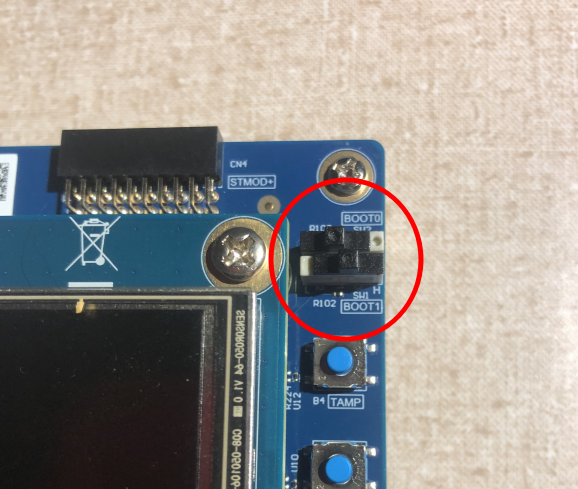
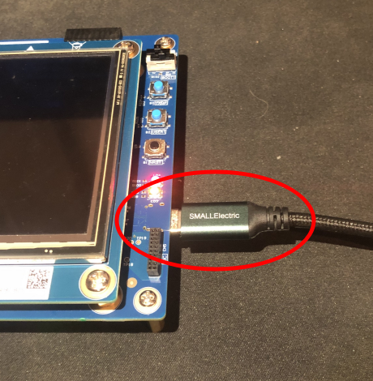
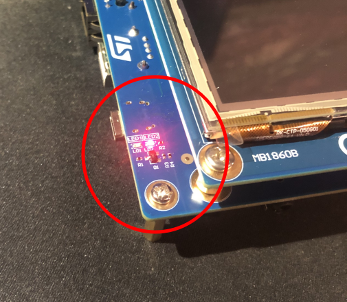
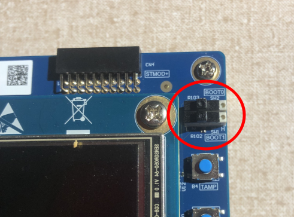
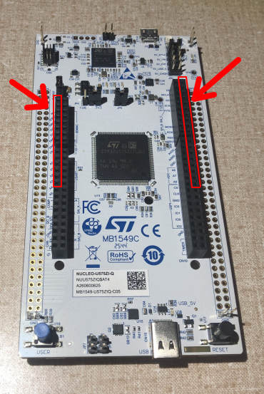
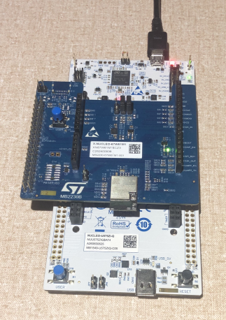
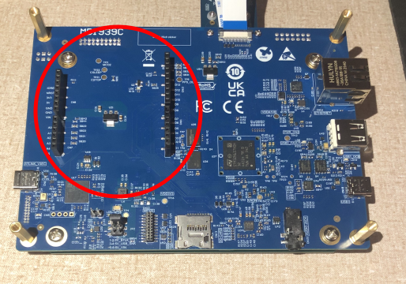
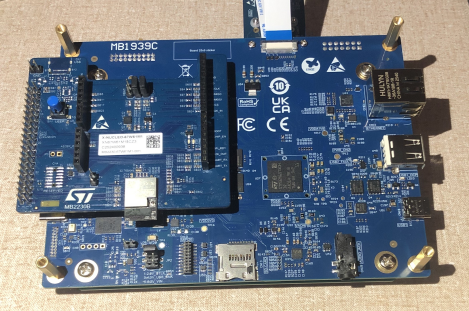

# STM32N6570-DK KVS WebRTC Quickstart AI Demo


## 1. Introduction

This guide will walk you through how to connect a STM32N6570-DK to /IOTCONNECT for:

- **Live video streaming** from the on-board camera to the /IOTCONNECT Video Streaming tab
  (AWS Kinesis Video Streams WebRTC)
- **On-device AI people detection** running on the STM32N6's Neural-ART NPU (YOLOv2), reported as
  telemetry (`ai_people`, `ai_top_conf`, `ai_infer_ms`) and drawn as overlay boxes on the board's LCD
- **Cloud commands** — start/stop video, LCD preview on/off, LED control

Two firmware variants are provided (see [Files to Download](#files-to-download)):
* **Wi-Fi Version** using the ST67W611M1 Wi-Fi 6 module (X-NUCLEO)
* **Ethernet Version** using the on-board Ethernet port

All steps work on Windows and Linux host machines. The only ST tool required is STM32CubeProgrammer.

## 2. Prerequisites

### Hardware

- [STM32N6570-DK](https://www.st.com/en/evaluation-tools/stm32n6570-dk.html) Discovery Kit
- 2× USB-C cables
- 5V USB Power Supply that **outputs at least 2A**
- **Wi-Fi variant only:**
    - [X-NUCLEO-67W61M1](https://www.st.com/en/evaluation-tools/x-nucleo-67w61m1.html) Wi-Fi module board
      (plugged onto the DK's Arduino headers)
    - A NUCLEO host board (e.g. [NUCLEO-U575ZI-Q](https://www.st.com/en/evaluation-tools/nucleo-u575zi-q.html))
    - A 2.4 GHz WPA2 Wi-Fi network
- **Ethernet variant only:** Ethernet Cable connected to a switch/router

### Software

- [STM32CubeProgrammer](https://www.st.com/en/development-tools/stm32cubeprog.html) **version `2.20.0` or newer**
  (the latest version is fine — this guide's images are pre-signed, and programming was validated
  with `2.23.0`)

- A serial terminal such as [Tera Term](https://teratermproject.github.io/index-en.html) or PuTTY

  > [!NOTE]
  > Linux: STM32CubeProgrammer needs udev rules the first time you connect a board:
  > ```sh
  > sudo cp ~/STMicroelectronics/STM32Cube/STM32CubeProgrammer/Drivers/rules/*.rules /etc/udev/rules.d/
  > sudo udevadm control --reload-rules && sudo udevadm trigger
  > sudo usermod -aG plugdev $USER   # then log out/in
  > ```

### Files to Download

Download each of the following files by opening the provided link, then click the **Download raw file** button at the 
top right of the file viewing window:

1. Your firmware variant pre-compiled hex code:
* Wi-Fi: [bin/quickstart/stm32n6570-dk-kvs-demo-wifi.hex](bin/quickstart/stm32n6570-dk-kvs-demo-wifi.hex)  
* Ethernet: [bin/quickstart/stm32n6570-dk-kvs-demo-ethernet.hex](bin/quickstart/stm32n6570-dk-kvs-demo-ethernet.hex)
2. The AI model: [bin/Model/network_data.hex](bin/Model/network_data.hex)
3. The device template: [IOTCONNECT_Templates/stm32n6wrt.json](IOTCONNECT_Templates/stm32n6wrt.json)
4. The config script for your host OS — [bin/device-config.ps1](bin/device-config.ps1) (Windows) or
   [bin/device-config.py](bin/device-config.py) (Linux)

## 3. Cloud Account Setup

An /IOTCONNECT account with an **AWS backend** is required. If you need to create an account, a
**free trial subscription** is available — no credit card required:

- Sign up: [https://subscription.iotconnect.io/subscribe?cloud=aws](https://subscription.iotconnect.io/subscribe?cloud=aws)
  (see the [AWS Marketplace option](https://github.com/avnet-iotconnect/avnet-iotconnect.github.io/blob/main/documentation/iotconnect/subscription/iotconnect_aws_marketplace.md) if you prefer)
- Log in: [https://console.iotconnect.io/login](https://console.iotconnect.io/login)

> [!NOTE]
> Be sure to check your SPAM folder for the temporary password after registering if you don't see
> it after a couple of minutes.

## 4. Program the STM32N6570-DK

### 4.1 Set Boot Switch to Dev Mode

1. With the board unplugged, set the **BOOT1** switch to the
   **right**. The BOOT0 switch position doesn't matter in this mode.



2. Connect a USB-C cable from your PC to the board's ST-LINK USB port (CN6).



3. Confirm that LED2 lights up to confirm Dev Mode is active.



### 4.2 Flash with STM32CubeProgrammer (GUI)

1. Open STM32CubeProgrammer and click **Connect** (top right; port `SWD`, mode `Hot plug`).
2. Click the **EL** (External Loader) icon in the left menu and check
   **`MX66UW1G45G_STM32N6570-DK`** — this enables writing to the DK's external NOR flash.
3. Open the **Erasing & Programming** panel (left menu, second icon).
4. Program the AI model: *File path* → browse to `network_data.hex` → click **Start Programming**.
   Wait for *File download complete* (this file is large — allow a few minutes).
5. **Program the firmware:** *File path* → browse to your variant hex
   (`stm32n6570-dk-kvs-demo-wifi.hex` or `stm32n6570-dk-kvs-demo-ethernet.hex`) →
   **Start Programming** → wait for *File download complete*.
6. **Disconnect** in STM32CubeProgrammer.

<details>
<summary><b>Command-line alternative (Windows & Linux)</b></summary>

Windows (PowerShell — adjust the installation path if needed):

```powershell
$P = "C:\Program Files\STMicroelectronics\STM32Cube\STM32CubeProgrammer20\bin"
$EL = "$P\ExternalLoader\MX66UW1G45G_STM32N6570-DK.stldr"
& "$P\STM32_Programmer_CLI.exe" -c port=SWD mode=HOTPLUG ap=1 -w network_data.hex -el $EL
& "$P\STM32_Programmer_CLI.exe" -c port=SWD mode=HOTPLUG ap=1 -w stm32n6570-dk-kvs-demo-wifi.hex -el $EL
```

Linux:

```sh
P=~/STMicroelectronics/STM32Cube/STM32CubeProgrammer/bin
EL=$P/ExternalLoader/MX66UW1G45G_STM32N6570-DK.stldr
$P/STM32_Programmer_CLI -c port=SWD mode=HOTPLUG ap=1 -w network_data.hex -el $EL
$P/STM32_Programmer_CLI -c port=SWD mode=HOTPLUG ap=1 -w stm32n6570-dk-kvs-demo-wifi.hex -el $EL
```

> [!NOTE]
> Substitute the `-ethernet` hex for the Ethernet variant of the demo.

</details>

### 4.3 Return Boot Switch to Run Mode

Unplug the USB cable, set **both** BOOT switches to the **left**, then reconnect. 



LED2 should now be off.

## 5. Wi-Fi Variant Only: Update the Wi-Fi Module Firmware

> [!TIP]
> For the Ethernet variant skip this step entirely.

The ST67W611M1 module runs its own firmware, and this demo requires the **T02 mission profile,
V1.3.0 or newer** (older versions have a WAN UDP bug that silently breaks WebRTC connectivity).
This is a one-time update, done with a NUCLEO host board as the programmer:

1. Plug the X-NUCLEO-67W61M1 onto the NUCLEO host board's Arduino headers, and connect USB to
   the NUCLEO's ST-LINK port.

> [!NOTE]
> The module's pins line up with the outermost pins of the NUCLEO host board, and should be plugged in 
> at the top of rows.





2. Clone ST's tool repo: `git clone https://github.com/STMicroelectronics/x-cube-st67w61.git`
3. From `x-cube-st67w61/Projects/ST67W6X_Scripts/Binaries/`, run
   `NCP_update_mission_profile_t02.bat` (Windows) or `./NCP_update_mission_profile_t02.sh` (Linux).

> [!IMPORTANT]
> On Linux, first run `chmod +x QConn_Flash/QConn_Flash_Cmd-ubuntu`

4. When the script reports success, move the X-NUCLEO board onto the STM32N6570-DK's Arduino
   headers. The NUCLEO host board is no longer needed.





## 6. Import the Device Template in /IOTCONNECT

1. Log in at [console.iotconnect.io](https://console.iotconnect.io).
2. Open the **Device** module:

   

3. At the bottom of the page, click **Templates**:

   

4. Click **Create Template**:

   

5. Click **Import**, and select the **`stm32n6wrt.json`** file you downloaded in Step 2:

   

## 7. Configure the Device

Using an automated script, the device generates its own key pair and certificate. 
Run the script for your host machine from wherever you saved it in Step 2.

**Windows:**

```powershell
.\device-config.ps1
```

**Linux / macOS:**

```sh
pip install pyserial
python3 device-config.py
```

### Configuration Script Walkthrough

1. The script auto-detects the board's serial port, reads the `thing_name` (and lets you keep or
change it), generates the key pair and certificate on-device, then prints the certificate and
pauses. 

Next you will jump over to /IOTCONNECT to create the device and paste this certificate into its configuration.

2. After logging into your /IOTCONNECT account on [console.iotconnect.io](https://console.iotconnect.io), go to the 
   **Device** page and click **Create Device**:

   

3. Set **Unique ID** *and* **Display Name** to the `thing_name` value from Step 7:

   

4. Select your **Entity**:

   

5. Select the template you imported (**STM32N6 W6X KVS WebRTC 2**):

   

6. Under the certificate section choose **Use my certificate**, and paste the certificate PEM from
   Step 7:

   

7. Under the streaming settings, set:
    - **Stream Type**: `Module Based`
    - **Stream Resource**: `WebRTC`
    - **Auto Start Video Stream**: leave **off** — you start the stream on demand from the console.
8. Click **Save & View**:

   

9. On the device's page, click the **paper-and-cog icon** (near *Connection Info*) to download the
   **device configuration JSON** — return to the config script from Step 7 and paste its
   contents in:

   

10. Open and then copy and paste the downloaded device configuration JSON back into the configuration script (end the paste
with `ENDJSON` on its own line)

11. The script finishes by prompting for and writing the connection config and finally resetting the board.

> [!NOTE]
> For the Ethernet variant of the demo, the Wi-Fi values are ignored by the firmware so you can just click ENTER through 
> the Wi-Fi credential prompts.

## 8. Using the Demo

1. Watch the serial terminal: within ~60 seconds the device connects to /IOTCONNECT
   (`[IOTC]` log lines), and the board's **LCD lights up with the live camera preview** — people in
   view get detection boxes drawn on them.
2. In the /IOTCONNECT console the device now shows **Connected**. Open the device's **Live Data**
   tab: telemetry arrives every few seconds, including the AI attributes:

   | Attribute     | Meaning                                          |
      |---------------|--------------------------------------------------|
   | `ai_people`   | People detected in frame (NPU YOLOv2)            |
   | `ai_top_conf` | Highest detection confidence (%)                 |
   | `ai_infer_ms` | NPU inference time (ms)                          |

3. Open the device's **Video Streaming** tab and click **Start** — after a few seconds the live
   camera stream appears in your browser, with AI detection running on-device simultaneously.
4. Try the cloud commands (**Command** tab): `LCD_ON` / `LCD_OFF` toggles the board's LCD preview;
   `LED_RED_ON`, `LED_GREEN_ON`, etc. control the user LEDs.

## 9. Going Further: Custom Development

Building from source, firmware architecture, security, the Wi-Fi/Ethernet transport internals, and
troubleshooting all live in one place: **[developer.md](developer.md)** — the full developer guide.

## 10. Resources

- [Full developer guide](developer.md) — building from source, architecture, security, troubleshooting
- [/IOTCONNECT overview](https://www.iotconnect.io/) · [/IOTCONNECT documentation](https://docs.iotconnect.io/)
- [STM32N6570-DK product page](https://www.st.com/en/evaluation-tools/stm32n6570-dk.html)
