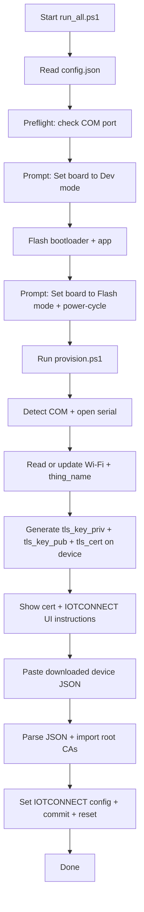

# Bin Quick Start (IOTCONNECT)

This `bin/` flow flashes and provisions the STM32N6570-DK for IOTCONNECT with automatic KVS WebRTC configuration.

## Files in `bin/`

- `flash.ps1` — flashes bootloader + application image
- `provision.ps1` — IOTCONNECT provisioning (calls `provision_iotconnect.ps1`)
- `provision_iotconnect.ps1` — full IOTCONNECT provisioning flow
- `run_all.ps1` — runs flash, then provisioning
- `config.json` — Wi-Fi settings
- `copy_hex_from_project.ps1` — copies build output from STM32CubeIDE

## Prerequisites

1. Windows + PowerShell
2. [STM32CubeProgrammer](https://www.st.com/en/development-tools/stm32cubeprog.html) installed
   - Version `2.20.x` is known-good with the signing command used in this repo
3. Board connected through ST-LINK USB
4. Internet access (scripts download Root CA automatically)
5. An IOTCONNECT account with a device template configured

## Quick Start

1. Edit `config.json` with your Wi-Fi credentials:
   ```json
   {
     "broker_type": "iotconnect",
     "wifi_ssid": "YOUR_WIFI",
     "wifi_credential": "YOUR_PASSWORD"
   }
   ```

2. If you built from STM32CubeIDE, run `.\copy_hex_from_project.ps1` first.

3. Run:
   ```powershell
   cd bin
   .\run_all.ps1
   ```

4. When prompted, set the board to **Dev mode**, press Enter.
5. After flashing, set the board to **Flash mode**, power-cycle, press Enter.
6. Follow the provisioning prompts to create the device in IOTCONNECT.

## What `run_all.ps1` Does



## KVS WebRTC

KVS WebRTC configuration is automatic when the IOTCONNECT device template has Video Streaming enabled.
No manual KVS configuration is needed — the firmware parses the KVS config from the IOTCONNECT identity response at runtime.

## Certificate and Runtime Configuration Storage

- Device certificates and runtime configuration are stored in external flash, separate from the application image.
- Accessed through PKCS#11 and KVS using the LittleFS stack.
- Reflashing firmware does not erase stored certificates/configuration.

---

[Back to Main README](../readme.md)
