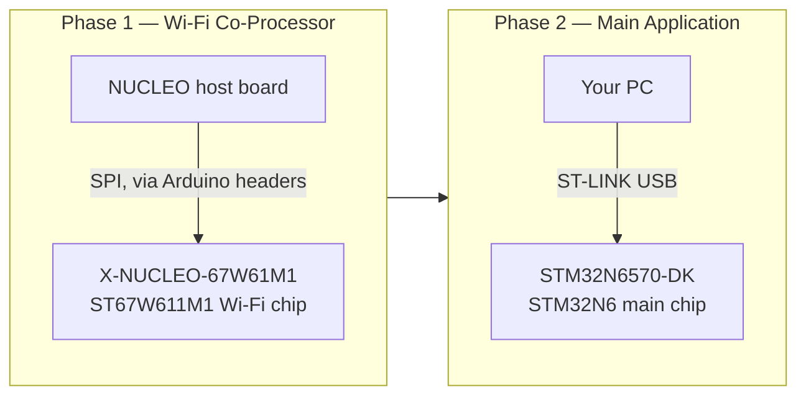
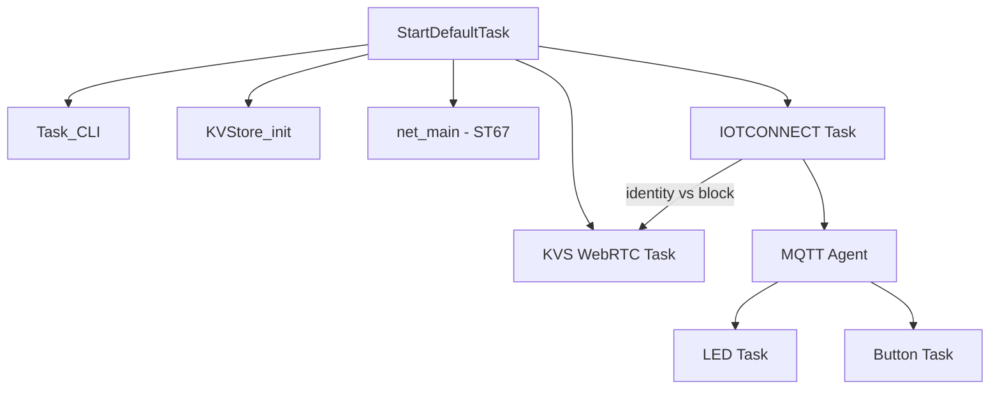
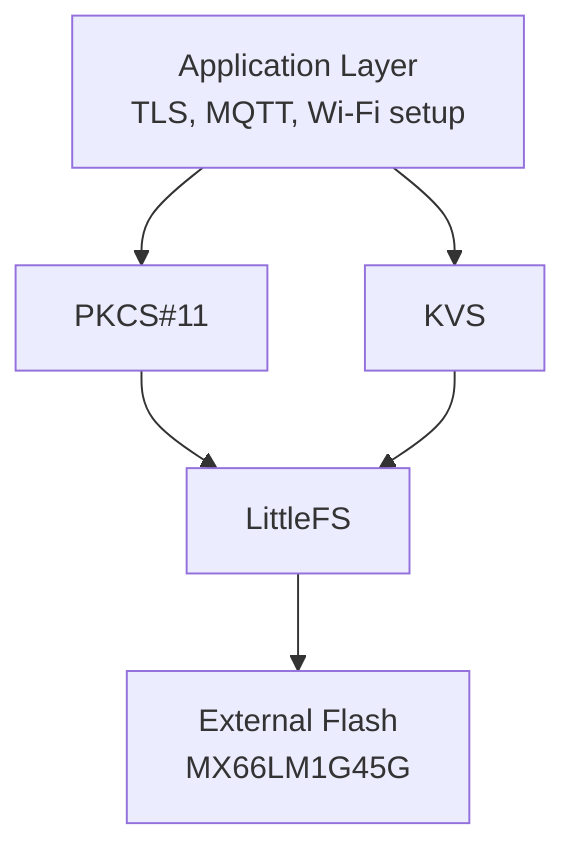

# STM32N6570-DK + ST67W611M1 + KVS WebRTC

### IOTCONNECT Reference Firmware with Live Video Streaming

[](https://www.st.com/en/evaluation-tools/stm32n6570-dk.html)
[](https://www.freertos.org/)
[](https://iotconnect.io/)
[](https://docs.aws.amazon.com/kinesisvideostreams-webrtc-dg/latest/devguide/what-is-kvswebrtc.html)
[](https://www.st.com/content/st_com/en/campaigns/st67w-wifi6-bluetooth-thread-module-z13.html)
[](./LICENSE.md)

IOTCONNECT reference firmware for the [STM32N6570-DK](https://www.st.com/en/evaluation-tools/stm32n6570-dk.html)
with [ST67W611M1](https://www.st.com/content/st_com/en/campaigns/st67w-wifi6-bluetooth-thread-module-z13.html) Wi-Fi 6
module.

> [!TIP]
> **🚀 New here? Start with the [QUICKSTART](README.md).** It takes you from nothing to a live
> device — IOTCONNECT account, flashing **pre-built firmware** (Wi-Fi *or* Ethernet variants,
> one-file hex images, no IDE or build tools), provisioning, and a working dashboard — using only
> STM32CubeProgrammer, on Windows or Linux. This guide covers the full project (building from
> source, architecture, module details) for developers going further than the quickstart.

---

1. [Hardware You Need](#hardware-you-need)
2. [Additional Required Software](#additional-required-software)
3. [The Two-Phase Flash Workflow](#the-two-phase-flash-workflow)
4. [Clone This Repository](#clone-this-repository)
5. [Build Configurations](#build-configurations)
6. [Build, Debug, and Flash](#build-debug-and-flash)
7. [Repository Structure](#repository-structure)
8. [Architecture](#architecture)
9. [Software Components](#software-components)
10. [Flash and RAM Memory Layout](#flash-and-ram-memory-layout)
11. [MQTT Data Model](#mqtt-data-model)
12. [Securing the Application](#securing-the-application)
13. [Wired Ethernet Transport](#wired-ethernet-transport)
14. [ST67W6X Wi-Fi Module Notes](#w6x-wifi-module-notes)
15. [Troubleshooting](#troubleshooting)
16. [Reference](#reference)

## Hardware You Need

This project involves **two separate boards**, because the Wi-Fi module firmware and the main application firmware are
flashed through two different pieces of hardware:

| Board                                              | Role                                                                                                                                                                            | Purchase Link                                                          |
|----------------------------------------------------|---------------------------------------------------------------------------------------------------------------------------------------------------------------------------------|------------------------------------------------------------------------|
| **STM32N6570-DK**                                  | The main development kit. Runs the application firmware you'll be working with for the rest of this guide.                                                                      | [st.com](https://www.st.com/en/evaluation-tools/stm32n6570-dk.html)    |
| **X-NUCLEO-67W61M1**                               | Expansion board carrying the ST67W611M1 Wi-Fi 6 module. This is what you're actually updating firmware on in Step 1.                                                            | [st.com](https://www.st.com/en/evaluation-tools/x-nucleo-67w61m1.html) |
| A **NUCLEO host board** (e.g. **NUCLEO-U575ZI-Q**) | Acts as the programmer for the X-NUCLEO-67W61M1. The X-NUCLEO board has no USB of its own — it needs a NUCLEO board's Arduino-shield headers and onboard ST-LINK to be flashed. | [st.com](https://www.st.com/en/evaluation-tools/nucleo-u575zi-q.html)  |

Also needed:

- Two USB cables (one for the NUCLEO host board's ST-LINK port, one for the STM32N6570-DK's ST-LINK port)
- An [IOTCONNECT account](https://iotconnect.io/) (a free trial is available)
- A network that **passes outbound UDP** — WebRTC's TURN relay uses **UDP port 443**, and many
  routers/firewalls silently drop it via "QUIC blocking" or advanced-security features (often
  alongside NTP/UDP-123 interception). On such networks the Wi-Fi build falls back to a TCP relay
  that can stall mid-stream. Symptoms, log diagnosis, and router fixes are in
  [Troubleshooting](#wi-fi-streaming-freezes-or-stalls-mid-session-router-udp-port-filtering);
  the wired Ethernet image is unaffected.

> [!NOTE]
> You only need the X-NUCLEO + NUCLEO pairing for **Step 1** (flashing the Wi-Fi module). Once that's done, everything
> else in this guide only touches the STM32N6570-DK.

---

## Additional Required Software

- [STM32CubeIDE](https://www.st.com/en/development-tools/stm32cubeide.html) — only needed if you're building firmware
  from source. Pre-built binaries are already committed under `bin/FSBL` and `bin/Appli`, so most users can skip this.

## The Two-Phase Flash Workflow

Before diving in, it helps to know what you're actually doing across the next few steps. There are **two independent
chips** involved, flashed through **two independent processes**, in a specific order:



1. **Wi-Fi co-processor firmware** (Step 1): The ST67W611M1 Wi-Fi chip runs its own separate firmware, called the **T02
   mission profile**. "T02" means the Wi-Fi chip runs a minimal network co-processor (NCP) stack while the main STM32N6
   handles the full LwIP network stack over SPI — as opposed to "T01," where LwIP runs embedded in the Wi-Fi chip
   itself. This repo's middleware is built around T02, so that's the profile you need. This firmware is pushed onto the
   Wi-Fi chip using a **separate NUCLEO board acting as a programmer** — the X-NUCLEO-67W61M1 has no USB connector of
   its own.

2. **Main application firmware** (Steps 2-4): The STM32N6 application (this repo's firmware) is flashed directly onto
   the STM32N6570-DK using its own onboard ST-LINK, completely independent of the Wi-Fi flashing hardware.

**Order matters**: flash the Wi-Fi module first. If the STM32N6570-DK application boots and tries to talk to Wi-Fi
firmware older than V1.3.0, WebRTC ICE/TURN negotiation will silently fail even though the device otherwise connects
fine.

---

## Clone This Repository

```sh
git clone --recurse-submodules https://github.com/avnet-iotconnect/iotc-stm32-n6-w6x-kvs-webrtc.git
cd iotc-stm32-n6-w6x-kvs-webrtc
```

---

## Build Configurations

| Configuration           | Crypto                | Use Case            |
|-------------------------|-----------------------|---------------------|
| **HW_Crypto** (default) | Hardware accelerators | Production          |
| **SW_Crypto**           | Software-only mbedTLS | Development/testing |

---

## Build, Debug, and Flash

This section explains the recommended STM32CubeIDE and STM32CubeMX workflow for building, debugging, and flashing firmware on STM32N6570-DK.

### Build in STM32CubeIDE

1. Import both projects:
   - `FSBL`
   - `Appli`
2. Build `Appli` for your current flow.
3. Build `FSBL` in:
   - Debug mode for debug sessions
   - Release mode for flashing and normal boot

### Debug in STM32CubeIDE

1. Build **FSBL** in **Debug** mode.
2. Set STM32N6570-DK to **Dev mode**.
3. Launch the provided debug configuration.
4. Let the debugger load:
   - `FSBL` (debug image)
   - `Appli` (RAM load)
5. Use hardware breakpoints.

### FSBL Debug and Release Boot Copy Behavior

In the FSBL path, `BOOT_Application()` in `Middlewares/ST/STM32_ExtMem_Manager/boot/stm32_boot_lrun.c` uses:

```c
#if !defined(_DEBUG_)
    retr = CopyApplication();
#endif
```

Meaning:

- Debug build: copy is skipped, and debugger-loaded RAM image is used.
- Release build: FSBL copies application image from external memory to RAM before jumping.

### Regenerating the Project with STM32CubeMX

#### Before Opening the `.ioc`

Install these packs in STM32CubeMX before opening the project `.ioc`:

- ARM.CMSIS-FreeRTOS 11.2.0
  https://www.keil.com/pack/ARM.CMSIS-FreeRTOS.11.2.0.pack
- ARM.mbedTLS 3.1.1
  https://www.keil.com/pack/ARM.mbedTLS.3.1.1.pack
- AWS backoffAlgorithm 4.2.0
  https://freertos-cmsis-packs.s3.us-west-2.amazonaws.com/AWS.backoffAlgorithm.4.2.0.pack
- AWS coreJSON 4.2.0
  https://freertos-cmsis-packs.s3.us-west-2.amazonaws.com/AWS.coreJSON.4.2.0.pack
- AWS coreMQTT 5.1.0
  https://freertos-cmsis-packs.s3.us-west-2.amazonaws.com/AWS.coreMQTT.5.1.0.pack
- AWS coreMQTT_Agent 5.1.0
  https://freertos-cmsis-packs.s3.us-west-2.amazonaws.com/AWS.coreMQTT_Agent.5.1.0.pack
- lwIP 2.3.0
  https://www.keil.com/pack/lwIP.lwIP.2.3.0.pack
- X-CUBE-ST67W61

When opening the `.ioc`, STM32CubeMX may request additional packs. Accept and install them.

#### After Regeneration

- Re-check `stm32_boot_lrun.c` and re-apply the `_DEBUG_` guard if it was overwritten.
- Run `update.sh`.

### Flash Firmware

1. Build **FSBL** in **Release** mode.
2. Set STM32N6570-DK to **Dev mode**.
3. Power-cycle the board.
4. Run one of:
   - `flash.sh`
   - `flash.ps1`
5. Set the board to **Flash boot mode**.
6. Power-cycle again.

### Certificate and Runtime Configuration Storage

- Device certificates and runtime configuration (Wi-Fi settings, MQTT endpoint, MQTT port) are stored in an external flash section that is separate from the main application image. For more details, see [Flash and RAM Memory Layout](#flash-and-ram-memory-layout).
- Certificates and configuration are accessed through PKCS#11 and KVS, using the littlefs (LFS) stack.
- Reflashing firmware does not erase or modify these stored certificates/configuration; they remain persistent in external flash.

### lwIP and MbedTLS Debug

#### Enable lwIP debug

In `Appli/Common/net/lwip_port/include/lwipopts_freertos.h`, uncomment the needed debug macros:

```c
/*#define LWIP_DEBUG                    LWIP_DBG_ON */
/*#define UDP_DEBUG                     LWIP_DBG_ON */
/*#define SOCKETS_DEBUG                 LWIP_DBG_ON */
/*#define TCP_DEBUG                     LWIP_DBG_ON */
/*#define NETIF_DEBUG                   LWIP_DBG_ON */
/*#define ETHARP_DEBUG                  LWIP_DBG_ON */
/*#define DHCP_DEBUG                    LWIP_DBG_ON */
/*#define IP_DEBUG                      LWIP_DBG_ON */
/*#define ICMP_DEBUG                    LWIP_DBG_ON */
/*#define RAW_DEBUG                     LWIP_DBG_ON */
/*#define DNS_DEBUG                     LWIP_DBG_ON */
```

#### Configure MbedTLS debug

In `Appli/Core/Inc/main.h`, use:

```c
/**************** MbedTLS debug config ****************/
#define MBEDTLS_DEBUG_NO_DEBUG                  0
#define MBEDTLS_DEBUG_ERROR                     1
#define MBEDTLS_DEBUG_CHANGE                    2
#define MBEDTLS_DEBUG_INFO                      3
#define MBEDTLS_DEBUG_VERBOSE                   4

#define MBEDTLS_DEBUG_THRESHOLD                 MBEDTLS_DEBUG_ERROR
```

`MBEDTLS_DEBUG_THRESHOLD` is used during TLS setup and handshake.

#### Runtime reset after MQTT connection

After MQTT connection is established, debug level is reset to `MBEDTLS_DEBUG_ERROR` in `vSleepUntilMQTTAgentConnected()` in `Appli/Common/app/mqtt/mqtt_agent_task.c`.

---

## Repository Structure

This section maps the repository layout and the role of each major module.

### Top-Level Layout

- `FSBL/` — first-stage bootloader project
- `Appli/` — main firmware project (FreeRTOS, networking, TLS, IOTCONNECT, KVS WebRTC)
- `bin/` — script-based flashing and provisioning flow
- `docs/` — technical documentation
- `IOTCONNECT_Templates/` — IOTCONNECT device template JSON

### `Appli/Common` Overview

#### `app/`

Application tasks:

- `mqtt/` — MQTT agent task, reconnect logic, subscription dispatch
- `iotconnect/` — IOTCONNECT runtime (identity, telemetry, commands, KVS config parsing)
- `kvs_webrtc/` — KVS WebRTC task (signaling, media pipeline)
- `led/` — LED desired/reported control
- `button/` — button event reporting

#### `cli/`

UART CLI framework and command handlers, including PKI and runtime configuration commands.

#### `config/`

Central middleware/runtime configuration headers:

- `kvstore_config.h`
- `lwipopts.h`
- `mbedtls_config.h`
- `core_mqtt_config.h`

#### `crypto/`

TLS and PKCS#11 integration:

- mbedTLS transport layer
- FreeRTOS integration hooks
- PKCS#11 PAL/helper components

#### `include/`

Shared public headers used across modules.

#### `kvstore/`

Non-volatile runtime configuration storage (KVS implementation).

#### `net/`

ST67 networking integration:

- `W6X_ARCH_T02/` — ST67 T02 architecture path
- `lwip_port/` — LwIP and FreeRTOS glue

#### `sys/`

Shared system utilities and support functions.

---

## Architecture

This section describes the runtime architecture and where key configuration points are located in the codebase.

### Runtime Overview

Boot starts in `StartDefaultTask`, which initializes CLI, KVS, networking, and then launches the IOTCONNECT and KVS WebRTC tasks.



Primary entry points:

- Task creation and startup: `Appli/Core/Src/app_freertos.c`
- Task toggles/priorities/stacks: `Appli/Core/Inc/main.h`
- IOTCONNECT runtime: `Appli/Common/app/iotconnect/iotconnect_runtime.c`
- KVS WebRTC task: `Appli/Common/app/kvs_webrtc/kvs_webrtc_task.c`

### IOTCONNECT + KVS WebRTC Integration

The IOTCONNECT task performs HTTPS identity discovery at boot. If the device template has Video Streaming enabled, the identity response contains a `vs` block with:
- `vs.carn` — KVS signaling channel ARN (region + channel name)
- `vs.url` — credentials endpoint + role alias

The IOTCONNECT task parses this and sets runtime config globals, then signals `EVT_MASK_IOTC_KVS_CONFIG`. The KVS WebRTC task waits for this event (with a 60s timeout) before connecting to the KVS signaling channel.

### FreeRTOS Configuration

FreeRTOS configuration is split between:

- Kernel configuration: `Appli/Core/Inc/FreeRTOSConfig.h`
- Project task configuration: `Appli/Core/Inc/main.h`

Key items in `main.h`:

- `DEMO_LED`, `DEMO_BUTTON`
- `TASK_PRIO_*`
- `TASK_STACK_SIZE_*`

### LwIP Configuration

LwIP behavior is configured in:

- `Appli/Common/config/lwipopts.h`
- `Appli/Common/net/lwip_port/include/lwipopts_freertos.h`

Integration sources:

- `Appli/Common/net/W6X_ARCH_T02/lwip.c`
- `Appli/Common/net/W6X_ARCH_T02/lwip_netif.c`
- `Appli/Common/net/lwip_port/lwip_freertos.c`

### mbedTLS Configuration

TLS/crypto integration spans:

- `Appli/core/inc/mbedtls_config_hw.h`
- `Appli/core/inc/mbedtls_config_ntz.h`
- `Appli/Common/crypto/mbedtls_freertos_port.c`
- `Appli/Common/net/lwip_port/mbedtls_transport.c`
- `Appli/Core/Src/corePKCS11/core_pkcs11_mbedtls.c`

### Security and RTOS Glue in `Appli/Core/Src`

#### `corePKCS11/`

- `core_pkcs11_mbedtls.c` implements PKCS#11 session/object/mechanism handling on top of mbedTLS.
- Used by TLS/provisioning flows to access device key/certificate objects.

#### `crypto/`

- **`core_pkcs11_pal_littlefs.c`** — PKCS#11 object storage on LittleFS
- **`core_pkcs11_pal_utils.c/.h`** — PKCS#11 label/handle to LittleFS filename mapping
- **`hardware_rng.c`** — Hardware RNG integration for mbedTLS entropy
- **`aes_alt.c`** — Hardware AES via STM32 CRYP peripheral
- **`ecdh_alt.c`** — Hardware ECDH via STM32 PKA peripheral
- **`ecdsa_alt.c`** — Hardware ECDSA via STM32 PKA peripheral
- **`ecp_alt.c`** — Hardware ECC point operations via PKA peripheral
- **`sha256_alt.c`** — Hardware SHA-256 via STM32 HASH peripheral

#### `FreeRTOS/`

- `freertos_hooks.c` contains RTOS hook implementations (idle, malloc-fail, stack overflow), watchdog helpers, and runtime stats helpers.

### LFS and PKCS11 Glue in `Appli/Libraries/`

#### `fs/`

LittleFS porting layer for the STM32N6570-DK (XSPI-based path):

- **`lfs_port_xspi.c`** — LittleFS port glue for XSPI
- **`xspi_nor_mx66uw1g45g.h`** — NOR flash definition for MX66UW1G45G
- **`stm32_extmem.c`** — ST External Memory Manager integration

#### `pkcs11/`

Public PKCS#11 Cryptoki API headers used by FreeRTOS-PKCS11 and the PAL layer.

---

## Software Components

This firmware stack is built on a focused set of core components.

### Core Stack

- FreeRTOS kernel
- LwIP network stack
- MbedTLS TLS/crypto library
- PKCS#11 object interface
- FreeRTOS CLI

### FreeRTOS CLI

The FreeRTOS CLI is used for runtime setup, provisioning, and diagnostics.

See:

- [Appli/Common/cli/ReadMe.md](Appli/Common/cli/ReadMe.md)

### PkiObject API

The PkiObject layer handles representation/conversion of certificates and keys used by TLS and provisioning flows.

See:

- [Appli/Common/crypto/ReadMe.md](Appli/Common/crypto/ReadMe.md)

### Security and Storage Architecture

PKCS#11 and KVS are intentionally separated:

- PKCS#11: cryptographic objects (device key/certificates, CA certificates)
- KVS: runtime configuration (MQTT endpoint/port, Wi-Fi credentials, thing name)

This provides a flexible architecture where keys and runtime configuration can be placed in internal flash, external flash, or a secure element (STSAFE) without changing high-level application logic.
In practice, PKCS#11 and KVS abstract the application from storage medium details and security implementation choices.



#### External Flash Storage Implementation

Keys, certificates, and runtime configuration are stored in **external flash** (MX66LM1G45G) accessed through abstraction layers:

- **Storage Abstraction**: Accessed via PKCS#11 and KVS libraries
- **File System**: LittleFS (LFS) creates a file system in external flash starting at block 64
  - Configuration: `Appli/Libraries/fs/xspi_nor_mx66uw1g45g.h` defines `MX66LM_RESERVED_BLOCKS (64)`
  - Port implementation: `Appli/Libraries/fs/lfs_port_xspi.c` provides the LFS port for STM32N6570-DK

For more details, see [Flash and RAM Memory Layout](#flash-and-ram-memory-layout).

**Data organization:**
- PKCS#11 objects (keys/certs): managed by `core_pkcs11_pal_littlefs.c`
- KVS configuration: stored and retrieved via KVS API (see [Appli/Common/kvstore/ReadMe.md](Appli/Common/kvstore/ReadMe.md))

---

## Flash and RAM Memory Layout

This section describes the memory organization and boot sequence for the STM32N6570-DK with FSBL (First Stage BootLoader) and application firmware.

### Overview

The STM32N6570 uses a **Load and Run** architecture where the FSBL loads the application from external flash into RAM before execution. This enables flexible code execution from a large external flash storage while maintaining performance through RAM execution.

For technical details on this boot model, see the ST community guide: [How to create an STM32N6 FSBL Load and Run](https://community.st.com/t5/stm32-mcus/how-to-create-an-stm32n6-fsbl-load-and-run/ta-p/768206)

### Flash Layout (External Flash - MX66LM1G45G)

**Base Address**: `0x70000000`

| Region | Address | Size | Purpose |
|--------|---------|------|---------|
| **FSBL** | `0x70000000` | 1 MB (16 blocks) | First Stage BootLoader image |
| **Application** | `0x70100000` | ~1 MB | Application firmware image (copied to RAM by FSBL) |
| **LittleFS** | `0x70400000`¹ | Remaining | File system for PKCS#11/KVS storage |

¹ **LFS Start Address Calculation**:
- `MX66LM_RESERVED_BLOCKS =  64`
- `MX66LM_BLOCK_SZ = ( 64 * 1024 )`
- `XPI_START_ADDRESS = MX66LM_RESERVED_BLOCKS × MX66LM_BLOCK_SZ`
- `XPI_START_ADDRESS = 64 × 65536 = 0x400000`
- `LFS Base = 0x70000000 + 0x400000 = 0x70400000`

In this example, 64 blocks are reserved for the FSBL and the Appli. The space reserved is controlled using the `MX66LM_RESERVED_BLOCKS` defined in [xspi_nor_mx66uw1g45g.h](Appli/Libraries/fs/xspi_nor_mx66uw1g45g.h)

**Total External Flash**: 512 Mbit (64 MB) organized as:
- 1024 blocks of 64 KB each
- 16 sectors (4 KB) per block
- First 64 blocks (4 MB) reserved for FSBL and Appli images

### RAM Layout (Internal STM32N6570)

| Address | Size | Purpose |
|---------|------|---------|
| `0x34000000` | 0x400 bytes | Application header (metadata, CRC, etc.) |
| `0x34000400` | ~1 MB | Application code and initialized data (copied from external flash by FSBL) |
| `0x34100000` | Remaining available | Application runtime RAM (variables, stack, heap) |
| `0x34180400` | FSBL runtime | FSBL location during boot (allocated by ROM bootloader) |

**Notes**:
- Application RAM at `0x34100000` can be extended to use all available STM32N6 internal RAM
- Total available internal RAM is determined by the specific STM32N6570 variant
- FSBL runtime location (`0x34180400`) becomes available to the application after boot completes

### Boot Sequence

1. **ROM Boot** → Internal STM32N6570 ROM bootloader executes
2. **Load FSBL** → ROM bootloader loads FSBL from external flash (`0x70000000`) to internal RAM at `0x34180400`
3. **Jump to FSBL** → ROM bootloader jumps to FSBL at `0x34180400`
4. **FSBL Copies Application** → FSBL reads application image from external flash (`0x70100000`) and copies it to internal RAM starting at `0x34000000`
5. **Jump to Application** → FSBL jumps to application entry point at `0x34000400`
6. **Application Executes** → Application runs from internal RAM with access to:
   - Code/initialized data at `0x34000000` - `0x34100000`
   - Runtime RAM (stack, heap, variables) at `0x34100000` onwards
   - FSBL memory at `0x34180400` now available for application use

### Application Addresses

**External Flash (Storage)**:
- **FSBL Location**: `0x70000000` (flashed from build output)
- **Application Location**: `0x70100000` (flashed from build output)
  - Entire application image stored here, including header
  - FSBL reads from this location during boot

**Internal RAM (Execution)**:
- **Application Header**: `0x34000000` - `0x34000400`
  - First `0x400` bytes contain metadata (CRC, version, etc.)

- **Application Code/Data**: `0x34000400` onwards
  - FSBL copies entire image (including header) to `0x34000000`
  - Entry point jumps to `0x34000400` where actual code begins

- **Application Runtime RAM**: `0x34100000` - end of available internal RAM
  - Stack, heap, and global variables
  - Can extend to utilize all available STM32N6 internal RAM

### Linker Script Configuration

The application linker script defines these memory regions:

**File**: `Appli/STM32N657X0HXQ_LRUN.ld`

```linker
MEMORY
{
  ROM    (xrw)    : ORIGIN = 0x34000400,   LENGTH = 1023K
  RAM    (xrw)    : ORIGIN = 0x34100000,   LENGTH = 1024K
}
```

- **ROM**: Specifies where the application code and initialized data execute in system RAM
- **RAM**: Specifies where runtime variables, stack, and heap are located in system RAM

The linker script ensures:
- Code and initialized data sections are placed in ROM (will be copied to RAM by FSBL)
- Runtime sections (stack, heap, uninitialized data) are placed in RAM

### Storage Backend (LittleFS)

PKCS#11 and KVS use external flash starting at `0x70400000` (after reserved blocks) for:
- Device certificates and keys
- Runtime configuration (Wi-Fi credentials, MQTT endpoint, etc.)
- Persistent application data

**Calculation**:
```
LFS_BASE = 0x70000000 (external flash base)
         + 0x400000 (64 reserved blocks × 64 KB)
         = 0x70400000
```

See [Software Components](#software-components) for details on PKCS#11/KVS architecture.

---

## MQTT Data Model

This project uses a simple topic model for LED control and button reporting.

### LED Control

Topics:

- Device subscribes to: `<thing>/led/desired`
- Device publishes to: `<thing>/led/reported`


Payload formats:

- JSON desired-state payloads (recommended)
- Raw fallback commands:
  - `LED_RED_ON`, `LED_RED_OFF`
  - `LED_GREEN_ON`, `LED_GREEN_OFF`

### Button Reporting

Topic:

- Device publishes to: `<thing>/sensor/button/reported`

Behavior:

- Publication occurs on button press/release transitions.
- Payload reports `USER_Button` state as `ON` or `OFF`.

### References

- LED guide: [Appli/Common/app/led/readme.md](Appli/Common/app/led/readme.md)
- Button guide: [Appli/Common/app/button/readme.md](Appli/Common/app/button/readme.md)

---

## Securing the Application

The STM32N6570 provides a strong security foundation for embedded IoT systems.
This reference firmware enables the hardware cryptographic accelerators and outlines additional security mechanisms that developers should activate when moving toward production‑grade deployments.

### Hardware Security

The STM32N6570 includes several built‑in security capabilities:

#### **Secure Engine (SE)**
Dedicated hardware accelerators for:
- RNG (true hardware entropy)
- SHA‑256 hashing
- AES encryption/decryption
- PKA (elliptic‑curve arithmetic)

| Accelerator | Use Case                                  | Implementation |
|-------------|--------------------------------------------|----------------|
| **RNG**     | Secure key generation, TLS nonce/IV       | `hardware_rng.c` |
| **SHA256**  | Certificate validation, message integrity | `sha256_alt.c` |
| **AES**     | TLS symmetric encryption                  | `aes_alt.c` |
| **PKA**     | TLS handshake (ECDSA), certificate auth   | `ecdh_alt.c`, `ecdsa_alt.c`, `ecp_alt.c` |

Enabled by default via MbedTLS hardware abstraction. See [Appli/Core/Src/crypto/CRYPTO_ACCELERATORS.md](Appli/Core/Src/crypto/CRYPTO_ACCELERATORS.md) for a full per-accelerator reference (functions, thread safety, usage in the TLS handshake).

#### **Memory Protection**
Hardware enforcement of:
- Flash/RAM access control
- Privilege levels
- Execution boundaries

#### **TrustZone‑M (Arm Cortex‑M55)**
Hardware‑enforced isolation between **Secure** and **Non‑Secure** worlds, enabling:
- Separation of trusted services from application code
- Protection of cryptographic keys and sensitive operations
- Reduced attack surface through compartmentalization

TrustZone‑M provides the foundation for secure boot, secure firmware update, and secure key storage by ensuring that critical operations execute only in the Secure domain.

#### **Memory Cipher Engine (MCE)**
The STM32N6570 includes a **Memory Cipher Engine** capable of encrypting and decrypting external memory regions on‑the‑fly.
MCE provides:

- **Transparent XIP encryption** for external flash
- **AES‑based inline encryption/decryption**
- **Protection of sensitive assets at rest**, including:
  - Configuration data
  - Credentials
  - PKCS#11 objects (if stored externally)
- **Low‑latency operation** suitable for real‑time workloads

MCE is recommended for deployments where external flash contains sensitive material or where physical access to the device is a realistic threat.

For more details:
*AN6088 – How to use MCE for encryption/decryption on STM32 MCUs*

#### Independent Watchdog (IWDG)

This firmware also enables the **Independent Watchdog (IWDG)** to ensure the system cannot remain stuck in a blocked state.
The watchdog is **refreshed from the FreeRTOS Idle Task**, ensuring that only a healthy, running scheduler can keep the system alive.

The **IWDG Early Wakeup Interrupt (EWU)** is also enabled.
It triggers shortly before the watchdog expires, allowing the firmware to capture diagnostic information.

#### Additional Resources
- [Security features on STM32N6 MCUs](https://wiki.st.com/stm32mcu/wiki/Security:Security_features_on_STM32N6_MCUs)

### Software Security

#### **Secure Boot**
Cryptographic verification of firmware integrity and authenticity at startup.

#### **OEMuRoT (OEM micro‑Root of Trust)**
Lightweight hardware‑anchored Root of Trust supporting:
- Secure provisioning
- Secure firmware updates
- Anti‑rollback protection

#### Additional Resources
- [OEMuRoT for STM32N6](https://wiki.st.com/stm32mcu/wiki/Security:OEMuRoT_for_STM32N6)

### Application‑Level Security

This firmware applies a defense‑in‑depth approach to protect device identity, communication, and cryptographic operations.

#### **Cryptographic Operations**
All sensitive operations — including TLS handshakes, hashing, and key generation — use hardware accelerators through the mbedTLS ALT layer when available.

#### **Key Management**
Device keys and certificates are provisioned securely and managed via the PKCS#11 abstraction layer.

#### **Secure Communication**
All MQTT traffic is protected using TLS 1.2+ with mutual authentication.

#### **Certificate Validation**
Server certificates are validated against trusted CA certificates stored on the device.

#### **Secure Provisioning**
The CLI‑based provisioning workflow supports secure onboarding with on‑device certificate generation and IOTCONNECT identity enrollment.

### Deployment Recommendations

To harden the system for production environments, the following measures are strongly recommended:

- **Use the `HW_Crypto` [build configuration](#build-configurations)** to maximize performance and ensure all supported hardware accelerators are enabled.
- **Enable Secure Boot** on the STM32N6570 to verify firmware authenticity before execution.
- **Review and customize `mbedtls_config.h`** based on your threat model, enabling only the required algorithms and disabling unused features.
- **Adopt secure firmware update mechanisms**, such as OEMuRoT‑based authenticated updates with anti‑rollback protection.
- **Protect device certificates and private keys** stored in external flash; for higher‑security deployments, consider integrating a secure element such as **STSAFE**.
- **Enable the Memory Cipher Engine (MCE)** to encrypt sensitive data stored in external flash and protect against physical extraction attacks.

---

<a id="wired-ethernet-transport"></a>

## Wired Ethernet Transport (ETH1 + RTL8211F, RGMII)

This project can run its entire network stack over the on-board **Gigabit
Ethernet** port instead of the ST67W6X Wi-Fi module. Wired Ethernet was added
as the transport for the KVS WebRTC video demo after the W6X Wi-Fi path proved
unable to sustain the upload bandwidth reliably (module-level TX stalls under
sustained load). The Wi-Fi path is untouched and is re-selected by flipping one
switch.

> **TL;DR** — `#define NET_USE_ETHERNET 1` in
> [`Appli/Core/Src/app_freertos.c`](Appli/Core/Src/app_freertos.c) selects
> Ethernet and compiles the W6X network task out of the build. Everything else
> is self-contained in
> [`Appli/Common/net/W6X_ARCH_T02/eth_netif.c`](Appli/Common/net/W6X_ARCH_T02/eth_netif.c).

### 1. The transport switch

`app_freertos.c` chooses exactly one network task at startup:

```c
#define NET_USE_ETHERNET 1

#if defined(ST67W6X_RCP) && !NET_USE_ETHERNET
    xTaskCreate(net_main,     "W6xNet", ...);   /* Wi-Fi (ST67W6X) */
#endif
#if NET_USE_ETHERNET
    xTaskCreate(eth_net_main, "EthNet", ...);   /* wired Ethernet  */
#endif
```

- `NET_USE_ETHERNET 1` → the `eth_net_main` task runs; `net_main` /
  `MX_LWIP_Init` **never run**. `eth_net_main` owns `tcpip_init`. The W6X Wi-Fi
  stack is dead code the linker garbage-collects (~30 KB ROM reclaimed).
- `NET_USE_ETHERNET 0` → back to the original Wi-Fi behaviour, unchanged.

**The one load-bearing contract:** every consumer (IoTConnect, KVS, NTP, …)
waits on `EVT_MASK_NET_CONNECTED` on the `xSystemEvents` event group. The
Ethernet path sets that bit when DHCP binds an address — identical to the Wi-Fi
path — so nothing downstream had to change.

### 2. Hardware

Facts taken from ST's STM32CubeN6 `Nx_WebServer` example for this exact board
(STM32N6570-DK).

| Item | Value |
|------|-------|
| MAC | STM32N657 **ETH1** (HAL ETH v2 API) |
| PHY | **RTL8211F(-CG)**, RGMII |
| MDIO / MDC | **PD12 / PD1** |
| PHY INTN | **PD3** |
| RGMII data/ctrl pins | PD1/3/12, PF0/2/5/7–15, PG3/4 |
| GTX_CLK | **PF0**, `GPIO_AF12_ETH1` (the one AF12 pin) — all other ETH pins `GPIO_AF11_ETH1` |
| MAC kernel clock | **HCLK** |
| RGMII RX/TX ref clocks | external (driven by PHY pads; reset default) |
| Interface select | `__HAL_RCC_ETH1PHY_CONFIG(RCC_ETH1PHYIF_RGMII)`; `CCIPR2` written by `HAL_ETH_Init` |
| Media interface | `HAL_ETH_RGMII_MODE` |

**RIF (security):** ETH1 is granted bus-master and slave-secure attributes so
its DMA can reach memory, mirroring how DCMIPP/VENC are already configured:

```c
HAL_RIF_RIMC_ConfigMasterAttributes(RIF_MASTER_INDEX_ETH1, &xMaster);
HAL_RIF_RISC_SetSlaveSecureAttributes(RIF_RISC_PERIPH_INDEX_ETH1, SEC|PRIV);
```

### 3. Software architecture — `eth_netif.c`

A single file (~450 lines). No BSP, no CubeMX ETH glue — it drives the N6 HAL
ETH v2 API directly and plumbs an lwIP `netif`.

**`eth_net_main` task** (created by `app_freertos.c`):
1. `tcpip_init` (this file owns it).
2. Seed the RX buffer free-list, build the MAC (§5), fill `ETH_HandleTypeDef`
   (`MediaInterface = HAL_ETH_RGMII_MODE`, `RxBuffLen = 1536`, TX/RX descriptor
   lists in NCRAM).
3. `HAL_ETH_Init` (its MspInit does clocks / GPIO / RIF), add the lwIP netif,
   register the link/status callbacks.
4. Loop forever:
   - **RX poll** every `ETH_RX_POLL_MS` (**2 ms**) — drain `HAL_ETH_ReadData`
     into pbufs, hand up to lwIP.
   - **Link poll** every `ETH_LINK_POLL_MS` (**500 ms**) — read RTL8211F link
     state, and on link-up program MAC speed/duplex, `HAL_ETH_Start`,
     `netif_set_link_up`, and start DHCP.

**RX path** — `HAL_ETH_RegisterRxAllocateCallback` / `RxLinkCallback` with an
`EthRxSeg_t` chain over a fixed pool of **6 × 1536-byte** buffers (`ucRxPool`).
Polling (no RX interrupt) keeps the ISR surface zero and coherency simple.

**TX path** — `prvLinkOutput`: clean the D-cache for each cacheable pbuf
segment, then a **blocking** `HAL_ETH_Transmit` (timeout `ETH_TX_TIMEOUT_MS =
100 ms`) on TX DMA channel 0 with `CRC_PAD_INSERT` and checksum offload
disabled, followed by `HAL_ETH_ReleaseTxPacket`.

**Link/DHCP** — `prvLinkUpdate` reads `RTL8211_GetLinkState`, sets
`PortSelect`/`Speed`/`Duplex` (`PortSelect = DISABLE` = GMII/RGMII 1000),
`HAL_ETH_SetMACConfig`, `HAL_ETH_Start`, `netif_set_link_up`, then
`netifapi_dhcp_start`. `prvStatusCallback` sets
`EVT_MASK_NET_CONNECTED` when the address binds.

The PHY driver is [`rtl8211.c/.h`](Appli/Common/net/W6X_ARCH_T02/rtl8211.c),
from [STMicroelectronics/stm32-rtl8211](https://github.com/STMicroelectronics/stm32-rtl8211)
(only `Init`/`DeInit`/`GetLinkState`/`SetLinkState` are implemented; BMCR reset
default already enables auto-negotiation). It exposes
`ENABLE_RTL8211F_TXDELAY` / `ENABLE_RTL8211F_RXDELAY` compile knobs for RGMII
clock-skew tuning — **not** currently defined (the board wiring / PHY strapping
provides the delay).

### 4. Memory & DMA coherency

The N6 HAL ETH driver does **no cache maintenance**. Rather than sprinkle
invalidate/clean calls, the DMA descriptors **and** the RX buffer pool live in a
small **non-cacheable** region carved from the top of app RAM. TX payloads stay
cacheable and are cleaned per-segment right before transmit.

Linker ([`STM32N657X0HXQ_LRUN_kvs.ld`](Appli/STM32N657X0HXQ_LRUN_kvs.ld)):

```
RAM   (xrw) : ORIGIN = 0x3410D400, LENGTH = 0xF0400   /* was 0xF2C00; -10K for the carve */
NCRAM (rw)  : ORIGIN = 0x341FD800, LENGTH = 0x2800    /* ETH DMA descriptors + RX pool */

.eth_nocache (NOLOAD) : { *(.eth_nocache) *(.eth_nocache*) } >NCRAM
```

`eth_netif.c` puts `xDmaTxDesc`, `xDmaRxDesc`, and `ucRxPool` in `.eth_nocache`
(via the `NC_SECTION` attribute) and, at init, programs an **MPU region** over
`0x341FD800 … 0x341FFFFF` as non-cacheable (`ETH_NOCACHE_BASE` /
`ETH_NOCACHE_LIMIT` must match the linker `NCRAM`).

> If you resize the RX pool or descriptor lists, keep the `NCRAM` length, the
> `RAM` length, `ETH_NOCACHE_*`, and the MPU region in sync.

### 5. MAC address

Locally-administered, derived from the device UID so each board is stable and
unique without provisioning:

```
02:80:E1:xx:yy:zz    where xxyyzz = (UIDw0 ^ UIDw1 ^ UIDw2)[23:0]
```

### 6. Build plumbing

Enabling Ethernet touches the (hand-maintained, mostly gitignored) CubeIDE make
files — only the specific files below are force-added to git:

- **HAL module:** `#define HAL_ETH_MODULE_ENABLED` in
  [`Appli/Core/Inc/stm32n6xx_hal_conf.h`](Appli/Core/Inc/stm32n6xx_hal_conf.h).
- **HAL driver sources** (copied byte-identical from ST HAL V1.3.0):
  `stm32n6xx_hal_eth.c`, `stm32n6xx_hal_eth_ex.c` — added to the HAL
  `subdir.mk` (C_SRCS/OBJS/DEPS + per-file compile rules) with matching
  `.c_includes.args`.
- **App sources:** `eth_netif.c`, `rtl8211.c` added to
  `Common/net/W6X_ARCH_T02/subdir.mk` and to `objects.list` (the linker input).

See [Repository Structure](#repository-structure) for how the CubeIDE make files are
tracked.

### 7. Bring-up log & troubleshooting

Healthy bring-up prints (over the debug UART):

```
[ETH] bring-up: RTL8211F RGMII, kernel=HCLK
... (link poll) ...
<INF> ... DHCP bound / NET_CONNECTED ...
```

then NTP, IoTConnect discovery/MQTT, and KVS all proceed exactly as on Wi-Fi.

| Symptom | Likely cause |
|---------|--------------|
| No link ever (link poll never reports up) | cable / PHY strapping; check MDIO on PD12, MDC on PD1 |
| Link up but DHCP never binds | RGMII clock skew — try `ENABLE_RTL8211F_TXDELAY` / `RXDELAY`; or no DHCP server on the segment |
| Random RX corruption / hard-fault in lwIP | NCRAM / MPU / linker lengths out of sync (see §4) |
| Consumers never start (stuck "waiting for network") | `EVT_MASK_NET_CONNECTED` not set — DHCP didn't bind |

### 8. Returning to Wi-Fi

Set `NET_USE_ETHERNET 0` in `app_freertos.c` and rebuild. The W6X task returns
and the Ethernet task compiles out. The Ethernet HAL module / driver sources and
`eth_netif.c` remain in the tree but are unreferenced (linker GCs them). Nothing
in the IoTConnect / KVS / NTP consumers changes — both transports satisfy the
same `EVT_MASK_NET_CONNECTED` gate.

---

<a id="w6x-wifi-module-notes"></a>

## ST67W6X (W6X / WL6) Wi-Fi Module — Design Notes & Known Issues

Design notes for the **ST67W611M** NCP (network co-processor) used as the
Wi-Fi transport on this project (X-NUCLEO-67W61M1 add-on, "W6X"/"WL6"). It is
an SPI-attached companion radio: the STM32N6 host runs the LwIP stack and the
**ST67W6X_Network_Driver** middleware, and the NCP handles 802.11 + BLE.

This section collects the module-level quirks we hit bringing up KVS WebRTC
streaming over Wi-Fi, why each matters, and how each is handled today. It is
transport-scoped: everything here is about the Wi-Fi path. The wired path
(`NET_USE_ETHERNET`, RTL8211F/RGMII) does **not** go through the W6X and is not
subject to these issues — see [Wired Ethernet Transport](#wired-ethernet-transport).

### Module identity (as tested)

| Field | Value |
|---|---|
| Host middleware | ST67W6X_Network_Driver **V1.3.0** |
| NCP SDK | 2.0.106 |
| Wi-Fi MAC | 1.6.44 |
| NCP build | Mar 20 2026 |
| NCP MAC | 40:82:7b:03:be:9c |
| Attach | SPI5 (W61 bus), single shared TX queue |

Upgrade history from the V1.2.0 tree is in
[Middlewares/ST/ST67W6X_Network_Driver/V130_UPGRADE_NOTES.md](Middlewares/ST/ST67W6X_Network_Driver/V130_UPGRADE_NOTES.md).
A V1.2.0 backup is preserved at `Middlewares/ST/ST67W6X_Network_Driver.v120_backup/`.

### 1. WAN-sourced UDP receive black-hole (the "UDP on the wrong channel" issue)

**Symptom (V1.2.0 middleware):** LAN UDP was delivered 100%, but **UDP arriving
from the public internet was silently dropped inside the NCP** before it ever
reached the host. This looked like "UDP coming back on the wrong channel / not
coming back at all": DNS to public resolvers, NTP/123, and — critically —
**TURN `Allocate` responses for the KVS relay path** never arrived, so relay
candidates could never be gathered and off-LAN viewers could not connect.

**Root cause:** The drop is in the NCP's SPI→802.11 forwarding path or its
802.11 MAC filter, **before** `BusIo_SPI_ReceivePtr()` pulls the frame from the
SPI RX queue. No host-side component (LwIP, netconn, socket listener, ICE) ever
sees the frame. Confirmed with a raw-UART source-IP trace in
`lwip_netif.c → netif_rx_process` (bypasses all LwIP/FreeRTOS): over ~60 s of
active TURN `Allocate` retransmission against two AWS TURN servers, **zero**
`[rx] udp` traces with a non-LAN source IP, while the outbound `sendto` markers
fired normally. Reproduced on two ISPs (Comcast + Verizon).

**Fix:** Upgrade to the **full X-CUBE-ST67W61 V1.3.0** middleware (host tree +
Target port files + LwIP glue). A partial upgrade (V1.3.0 W61_bus files only on
a V1.2.0 tree) is **not** sufficient. Verified on the N6: public DNS/53
responses from `74.40.74.40` now arrive reliably at `netif_rx_process`, and the
KVS UDP relay path works.

**Related bug report:** filed to the ST firmware team 2026-04-14; artifacts
preserved under `_st_bugreport_artifacts/` (raw-UART trace patch, config
extracts, the V1.2.0→V1.3.0 delta, and a flat zip).

**Note on NTP:** NTP/123 to public servers can still fail on some LANs even with
V1.3.0 — that is a **network policy** issue (e.g. Google Nest/Google Wifi
intercepting client NTP), not the NCP. The HTTP time fallback in `sntp_port.c`
handles it; keep it.

### 2. NCP power-save must be disabled for real-time media

**Issue:** With the NCP's automatic power-save enabled, the radio drops into
low-power states between packets. That adds latency/jitter and can delay or drop
frames — fatal for real-time RTP media and for TURN keepalives, which the relay
uses to keep the allocation alive. Enabling power-save correlated with erratic
streaming and premature session teardown.

**Fix / config:** Power-save is disabled and must stay disabled for the
streaming build:

- `W6X_POWER_SAVE_AUTO = 0` in `Appli/ST67W6X_Network_Driver/Target/w6x_config.h`
- `W61_SetPowerMode(_, 0, 0)` at bring-up
- `W61_MAX_SPI_XFER = 1520` (matches the V1.3.0 default / ST recommendation)

**Trade-off:** Higher idle power draw. Acceptable for a mains-/USB-powered demo;
revisit only if a battery use-case appears (and then only for periods with no
active KVS session).

### 3. Shared-SPI TX flow-control (`rx_stall`) and the session-stability stack

**Issue:** Media TX, MQTT, and AT control all share **one** SPI TX queue to the
NCP. When the module asserts `rx_stall` flow control (it prioritizes draining
its RX path), **all** host→NCP TX freezes — media *and* MQTT stall together.
Combined with a few driver liveness holes, this produced the long-running "KVS
session drop" saga (sessions dying anywhere from 11 s to 231 s).

**Resolved** 2026-07-20/21 as a stack of fixes (feature/ai-detection,
`b7d3496..ab16022`, `af5b668`, `aaa92f1`). The load-bearing config landing spots
(the only *live* override headers):

- `SPI_TXQ_LEN = 32` in `Appli/ST67W6X_Network_Driver/Target/w61_driver_config.h`
- `W6X_NETIF_STA_RXQ_DEPTH = 32` in `Target/w6x_config.h`
- tcpip mbox 64 / prio 45 / stack 1024 in `lwipopts_freertos.h`
- `TCP_MSS = 1150` in `Appli/Common/config/lwipopts.h` (see §4)

Brief cause list (each masked the next): DCMIPP IPPLUG partition starvation;
an `lwip_netif.c` RX-error path **double-free** (heap corruption → the lifetime
lottery); the `rx_stall` whole-stack convoy above; SPI engine liveness holes
(edge-only `TXN_RDY`, unbounded hdr-ack loop); and an ICE close-gate calibrated
for slow strikes. Full detail and the diagnosis playbook live in the commit
history; the diagnostic vocabulary is summarized in §5.

### 4. TCP-TLS TURN relay wedges on Wi-Fi (UDP relay is the reliable path)

**Issue:** The W6X **TCP transmit path** stalls under sustained load. When a KVS
session is nominated onto the **`turns:...?transport=tcp`** relay (TURN-over-TLS
on TCP/443), large RTP segments jam: the TCP `snd_buf` never drains
(`[TLS] snd stall len=… done=0 e=11`), the socket mutex times out
(`socketMutex timeout (1500 ms) — prior send wedged`), and the ICE close gate
eventually fires (`[icn] GATE CLOSE fails=… span=…`). This is a **W6X SPI-side
TCP-TX defect** — it is Wi-Fi-only and does **not** occur on Ethernet.

Two things make the **UDP** relay path solid instead:
- WAN UDP RX now works (§1), so the plain-UDP TURN `Allocate` succeeds and
  DTLS/UDP media flows through the relay.
- The ICE filter in `Appli/Libraries/kvs_webrtc/examples/app_common/app_common.c`
  accepts `turn:...?transport=udp` (UDP relay), skips only
  `turns:...?transport=udp` (DTLS-TURN-over-UDP, which `ice_controller_net.c`
  rejects), and keeps `turns:...?transport=tcp` as a fallback.

ICE prioritizes the UDP relay over the TCP relay, so in normal use the device
streams cleanly over UDP (validated 2+ min, `ovr=0`, zero `[TLS] snd stall`).
The TCP relay is only nominated when the UDP relay pair fails connectivity for a
particular viewer.

**Mitigation in place — ICE close-timeout.** Independently of transport choice,
a stuck relay teardown used to wedge the peer-connection slot forever (the W6X
relay never confirms the TURN release), and after both of the 2 slots wedged the
master silently dropped every new viewer. That is fixed with a bounded deadline
in `ice_controller.c` (`ICE_CONTROLLER_CLOSING_TIMEOUT_MS`, default 2000 ms):
after the deadline the lingering sockets are force-closed and `ICE_CLOSED` is
emitted so the slot re-arms. Net effect: even if a session lands on the TCP
relay and wedges, it **self-heals** — forced teardown in ~2 s, and the next
viewer connects (typically over UDP). Validated: back-to-back viewers with no
board reset.

#### Attempted + REVERTED: dropping `turns:tcp` on Wi-Fi (2026-07-25)

The idea was: since ICE sometimes nominates the wedging TCP relay (intermittent
black screen on Start), drop `turns:?transport=tcp` on Wi-Fi so only the UDP
relay is used. Implemented behind `KVS_TURN_DROP_TCP` (`demo_config.h`) with the
ICE-filter skip wrapped in `#if KVS_TURN_DROP_TCP`.

**It made things worse and was reverted (`KVS_TURN_DROP_TCP` defaults to 0).**
Fresh-boot, first-ever Start Video with the drop active gathered **only host +
srflx candidates, no relay at all** (`Unable to find valid connection … closing`
→ black). Root cause the test exposed:

- **The W6X's plain-UDP TURN Allocate is intermittent** — the Allocate response
  over WAN UDP doesn't reliably arrive, so a `turn:?transport=udp`-only config
  frequently yields **no relay candidate**.
- **`turns:tcp` (TLS/TCP Allocate) was the *reliable* relay** all along — TCP
  delivers the Allocate response every time, so a relay candidate always forms.
  Sessions were connecting *because* of the TCP relay; removing it left only the
  flaky UDP Allocate and often no relay → couldn't connect.

So `turns:tcp` must stay. The remaining symptom is the **TCP relay's media path
wedging once nominated** (`[TLS] snd stall` → `GATE CLOSE` → black-after-connect,
which the close-timeout then self-heals). The correct fix is **not** removing the
TCP relay but making the **UDP relay reliable or preferred**:
- Make the UDP TURN Allocate robust (retry / confirm the Allocate response is
  actually arriving over WAN UDP for the relay flow, not just DNS).
- And/or bias ICE nomination toward the UDP relay pair when it *does* allocate.

The `KVS_TURN_DROP_TCP` flag + filter block are left in place (default 0, i.e.
no-op) as documentation of the dead end.

### 5. Diagnostic vocabulary (W6X health, in logs)

These markers are always-on raw prints (the `LogWarn`/`LogError` variants in
`ice_controller_net.c` compile out):

| Marker | Meaning |
|---|---|
| `[M] … isnd=` | W6X TX health. Healthy 2–30 ms; **>1000 = link dying**. |
| `rx_stall BEGIN/END dur=` | NCP credit/flow-control episode (host→NCP TX paused). Brief (≤~15 ms) is benign; sustained bursts choke TX. |
| `socketMutex timeout (1500 ms) — prior send wedged` | A TX stalled long enough to block the next send (TCP-TX wedge signature). |
| `[TLS] snd stall len= done= z= e=` | TURN-over-TLS/TCP send stalled. `done=0 e=11` (WANT_WRITE) → `snd_buf` never drains → segment size vs path MTU (see §4 MSS fix). |
| `[icn] GATE CLOSE fails= span=` | ICE close gate tripped after N send failures spanning the window. |
| `TURN release not confirmed after N ms; forcing socket teardown` | §4 close-timeout firing — the W6X relay never confirmed the TURN release; slot is being force-reclaimed. Expected on Wi-Fi relay teardown. |
| `[rx] udp src=… sp=… dp=…` | Raw inbound-UDP trace (diagnostic, normally compiled out via `WAN_UDP_RX_DIAG` in `lwip_netif.c`). Used to prove §1. |

### References

- [Wired Ethernet Transport](#wired-ethernet-transport) — the wired transport (not affected by any of the above).
- [Middlewares/ST/ST67W6X_Network_Driver/V130_UPGRADE_NOTES.md](Middlewares/ST/ST67W6X_Network_Driver/V130_UPGRADE_NOTES.md) — V1.2.0 → V1.3.0 upgrade.
- `_st_bugreport_artifacts/` — the WAN-UDP-RX bug report package filed to ST.
- Config: `Appli/ST67W6X_Network_Driver/Target/w6x_config.h`, `Target/w61_driver_config.h`, `Appli/Common/config/lwipopts.h`, `lwipopts_freertos.h`.
- ICE: `Appli/Libraries/kvs_webrtc/examples/app_common/app_common.c` (server filter), `.../ice_controller/ice_controller.c` (close-timeout).

---

## Troubleshooting

Common issues and practical fixes.

### COM Port Busy / Access Denied

Symptoms:

- Serial port open fails
- `Access to the port 'COMxx' is denied`

Fix:

1. Close other serial tools using the same COM port (PuTTY, TeraTerm, VS Code serial monitor, etc.).
2. Rerun `bin\run_all.ps1` or the config script.

### Board Does Not Boot or Debug

Check:

1. Board mode is correct for the current step (Dev mode for debug/flash sequence).
2. If board mode changed mid-session, reflash and retry.

### Signed Application Does Not Boot

Symptoms:

- Flash appears to succeed
- FSBL starts, but the signed application does not boot correctly
- Behavior changes depending on STM32CubeProgrammer version

Check:

1. If you built from STM32CubeIDE, run `bin\copy_hex_from_project.ps1` before `bin\run_all.ps1` or `bin\flash.ps1`.
2. Confirm the staged files under `bin\Appli\...` and `bin\FSBL\...` match the build configuration you actually built.
3. STM32CubeProgrammer `2.21.0+` no longer auto-pads STM32N6 payloads to the `0x400` offset —
   the `-align` / `--align` flag is **mandatory** there (ST errata). Without it, flash and verify
   succeed but the image **silently never boots**: the payload lands at file offset `0x240` while
   the header entry point and vectors are linked for `0x400`, so the BootROM jumps into misplaced
   bytes. `2.20.x` pads automatically and has no `-align` flag.
4. `bin\flash.ps1` handles this automatically: it detects `-align` support in the installed
   signing tool's help text and appends the flag when present. If signing manually, add `-align`
   on `2.21.0+` only.
5. Root cause confirmed empirically (2026-07-26): a `2.23.0 -align` image is byte-identical to a
   `2.20.0` image outside the random-fill padding extension (`0xA8`–`0x23F`, which differs even
   between two consecutive runs of the same version). Both signing paths and `2.23.0` programming
   validated on-board.

References:

- ST errata ("-align mandatory with STM32N6 from v2.21.0"): https://wiki.st.com/stm32mcu/wiki/STM32CubeProgrammer_errata_2.23.x
- ST announcement: https://community.st.com/t5/stm32cubeprogrammer-mcus/signingtool-for-stm32n6-in-stm32cubeprogrammer-v2-21-0/td-p/859154
- https://community.st.com/t5/stm32cubeprogrammer-mcus/no-padding-align-with-padding-in-stm32-signingtool-cli-2-21/td-p/859110
- Same regression + fix in Zephyr: https://github.com/zephyrproject-rtos/zephyr/issues/99456

### Debug Load Issues After STM32CubeMX Regeneration

STM32CubeMX can overwrite boot files used by the debug flow.

Verify and re-apply in `Middlewares/ST/STM32_ExtMem_Manager/boot/stm32_boot_lrun.c`:

```c
#if !defined(_DEBUG_)
    retr = CopyApplication();
#endif
```

Then run `update.sh` and restart debug.

### IOTCONNECT Device Not Connecting

Check:

1. Wi-Fi credentials in `bin/config.json` are correct.
2. The pasted device JSON belongs to the created device.
3. `Unique Id` in IOTCONNECT matches the board `thing_name`.
4. Rerun `bin\device-config.ps1` to reprovision without reflashing.

### KVS WebRTC Video Not Streaming

Check:

1. **ST67W611M module firmware and X-CUBE-ST67W61 middleware must be V1.3.0 or later.** Earlier versions have a WAN UDP receive bug that prevents WebRTC ICE/TURN relay negotiation from completing. The device will connect to IOTCONNECT but video streaming will fail.
2. The IOTCONNECT device template has **Video Streaming** enabled.
3. Serial log shows `[KVSWebRTC]` lines — if missing, the KVS task did not start.
4. If using an external 5V supply, ensure it is stable. USB power from ST-LINK alone can cause brownouts during streaming.

### Wi-Fi Streaming Freezes or Stalls Mid-Session (Router UDP Port Filtering)

**Symptom:** On the Wi-Fi build, viewer sessions connect but the video freezes
after ~20-90 s with `[TLS] snd stall ... e=11` then `GATE CLOSE` in the serial
log, and boot-time NTP always falls back to HTTP (`[NTP] select timeout` for
every server, then `[HTTP] time set OK`). Streaming on the same firmware works
perfectly on other networks.

**Diagnosis (read it straight off the serial log):** during ICE gathering the
one-shot `[icn] relay ...` markers show what each TURN server did:

```
[icn] relay[1] ... proto=2 ... [icn] relay CREATED proto=2    <- TLS/TCP relay OK
[icn] relay[2] ... proto=1 ... [icn] relay IN_PROGRESS proto=1  <- UDP relay Allocate never answered
[icn] tcp-relay priority demoted
```

If the UDP relay (`proto=1`) never reaches `CREATED`, every session is forced
onto the TLS/TCP relay — whose media path can wedge under sustained load (the
known W6X TCP-TX stall, see [ST67W6X Wi-Fi Module Notes](#w6x-wifi-module-notes)). Compare the UDP ports the
network passes: DNS (UDP/53) resolves fine, NTP (UDP/123) gets no reply, and
the KVS TURN Allocate (UDP/443) gets no reply. That pattern is **router policy,
not firmware**: many routers/firewalls ship "QUIC blocking" or advanced-security
features that silently drop outbound UDP/443, and commonly intercept client NTP
(UDP/123) as well.

**What to do:**

1. **Fix the router (preferred).** In the router's security settings disable
   QUIC/UDP-443 blocking (or exempt the device's MAC/IP), and allow outbound
   NTP. Names vary: "QUIC filtering", "advanced security", "protected
   browsing", "UDP flood protection".
2. **Confirm it's the network** by booting the same firmware on a different
   LAN or hotspot: `[icn] relay CREATED proto=1` should appear and sessions
   run stall-free on the UDP relay (validated 127 s+, zero TLS stalls).
3. **Use the wired Ethernet image** (`bin/quickstart/...-ethernet.hex`) — its
   TCP path does not have the W6X TX stall, so it streams reliably even behind
   a filtering router. Credentials are preserved when swapping images.
4. **NTP-only relief:** the firmware already falls back to HTTP time (works
   everywhere, ~10 s slower boot). You can also point NTP elsewhere without
   reflashing: `conf set ntp_host <server>` / `conf set ntp_port <port>` at
   the CLI, stored in littlefs.

Even when stuck on the TLS/TCP relay the firmware self-heals: a wedged session
is torn down via the ICE close-timeout and the next viewer connect retries.
The TCP relay candidate is advertised at minimum ICE priority, so the moment
the network lets the UDP Allocate through, sessions automatically prefer the
reliable UDP relay.

---

## Reference

- Hardware crypto: [Appli/Core/Src/crypto/CRYPTO_ACCELERATORS.md](Appli/Core/Src/crypto/CRYPTO_ACCELERATORS.md)
- IOTCONNECT template: [IOTCONNECT_Templates/README.md](IOTCONNECT_Templates/README.md)
- LED app: [Appli/Common/app/led/readme.md](Appli/Common/app/led/readme.md)
- Button app: [Appli/Common/app/button/readme.md](Appli/Common/app/button/readme.md)
- CLI: [Appli/Common/cli/ReadMe.md](Appli/Common/cli/ReadMe.md)
- Crypto: [Appli/Common/crypto/ReadMe.md](Appli/Common/crypto/ReadMe.md)
- KVStore: [Appli/Common/kvstore/ReadMe.md](Appli/Common/kvstore/ReadMe.md)
