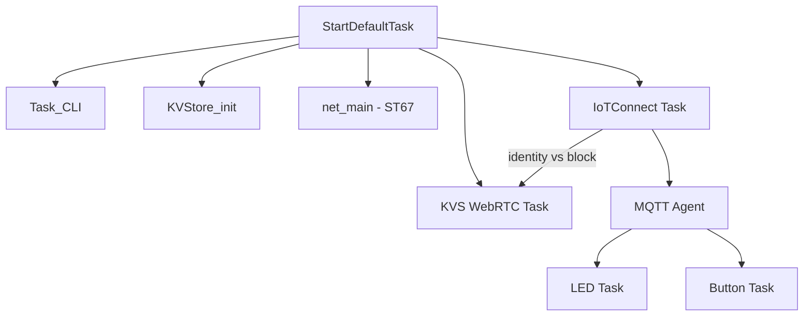

# Architecture

This document describes the runtime architecture and where key configuration points are located in the codebase.

## Runtime Overview

Boot starts in `StartDefaultTask`, which initializes CLI, KVS, networking, and then launches the IoTConnect and KVS WebRTC tasks.

Primary entry points:

- Task creation and startup: `Appli/Core/Src/app_freertos.c`
- Task toggles/priorities/stacks: `Appli/Core/Inc/main.h`
- IoTConnect runtime: `Appli/Common/app/iotconnect/iotconnect_runtime.c`
- KVS WebRTC task: `Appli/Common/app/kvs_webrtc/kvs_webrtc_task.c`

## IoTConnect + KVS WebRTC Integration

The IoTConnect task performs HTTPS identity discovery at boot. If the device template has Video Streaming enabled, the identity response contains a `vs` block with:
- `vs.carn` — KVS signaling channel ARN (region + channel name)
- `vs.url` — AWS IoT credentials endpoint + role alias

The IoTConnect task parses this and sets runtime config globals, then signals `EVT_MASK_IOTC_KVS_CONFIG`. The KVS WebRTC task waits for this event (with a 60s timeout) before connecting to the KVS signaling channel.

## FreeRTOS Configuration

FreeRTOS configuration is split between:

- Kernel configuration: `Appli/Core/Inc/FreeRTOSConfig.h`
- Project task configuration: `Appli/Core/Inc/main.h`

Key items in `main.h`:

- `DEMO_LED`, `DEMO_BUTTON`
- `TASK_PRIO_*`
- `TASK_STACK_SIZE_*`

## LwIP Configuration

LwIP behavior is configured in:

- `Appli/Common/config/lwipopts.h`
- `Appli/Common/net/lwip_port/include/lwipopts_freertos.h`

Integration sources:

- `Appli/Common/net/W6X_ARCH_T02/lwip.c`
- `Appli/Common/net/W6X_ARCH_T02/lwip_netif.c`
- `Appli/Common/net/lwip_port/lwip_freertos.c`

## mbedTLS Configuration

TLS/crypto integration spans:

- `Appli/core/inc/mbedtls_config_hw.h`
- `Appli/core/inc/mbedtls_config_ntz.h`
- `Appli/Common/crypto/mbedtls_freertos_port.c`
- `Appli/Common/net/lwip_port/mbedtls_transport.c`
- `Appli/Core/Src/corePKCS11/core_pkcs11_mbedtls.c`

## Security and RTOS Glue in `Appli/Core/Src`

### `corePKCS11/`

- `core_pkcs11_mbedtls.c` implements PKCS#11 session/object/mechanism handling on top of mbedTLS.
- Used by TLS/provisioning flows to access device key/certificate objects.

### `crypto/`

- **`core_pkcs11_pal_littlefs.c`** — PKCS#11 object storage on LittleFS
- **`core_pkcs11_pal_utils.c/.h`** — PKCS#11 label/handle to LittleFS filename mapping
- **`hardware_rng.c`** — Hardware RNG integration for mbedTLS entropy
- **`aes_alt.c`** — Hardware AES via STM32 CRYP peripheral
- **`ecdh_alt.c`** — Hardware ECDH via STM32 PKA peripheral
- **`ecdsa_alt.c`** — Hardware ECDSA via STM32 PKA peripheral
- **`ecp_alt.c`** — Hardware ECC point operations via PKA peripheral
- **`sha256_alt.c`** — Hardware SHA-256 via STM32 HASH peripheral

### `FreeRTOS/`

- `freertos_hooks.c` contains RTOS hook implementations (idle, malloc-fail, stack overflow), watchdog helpers, and runtime stats helpers.

## LFS and PKCS11 Glue in `Appli/Libraries/`

### `fs/`

LittleFS porting layer for the STM32N6570-DK (XSPI-based path):

- **`lfs_port_xspi.c`** — LittleFS port glue for XSPI
- **`xspi_nor_mx66uw1g45g.h`** — NOR flash definition for MX66UW1G45G
- **`stm32_extmem.c`** — ST External Memory Manager integration

### `pkcs11/`

Public PKCS#11 Cryptoki API headers used by FreeRTOS-PKCS11 and the PAL layer.
