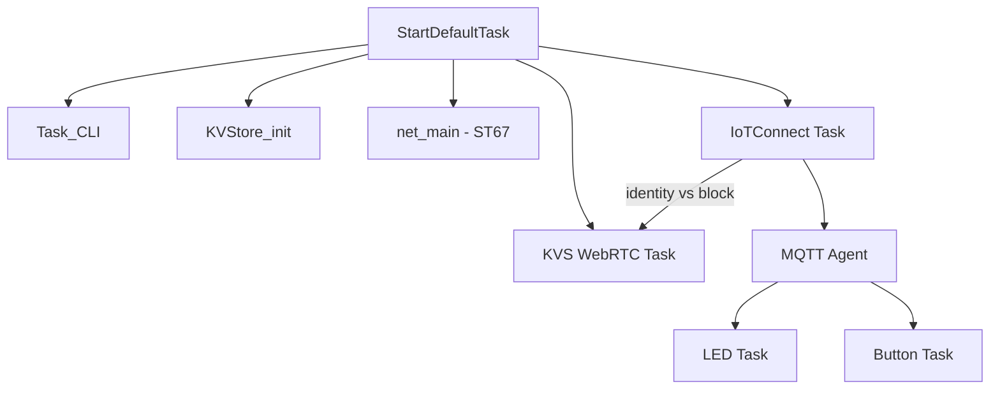

# STM32N6570-DK + ST67W611M1 + KVS WebRTC
### IoTConnect Reference Firmware with Live Video Streaming

[](https://www.st.com/en/evaluation-tools/stm32n6570-dk.html)
[](https://www.freertos.org/)
[](https://iotconnect.io/)
[](https://docs.aws.amazon.com/kinesisvideostreams-webrtc-dg/latest/devguide/what-is-kvswebrtc.html)
[](https://www.st.com/content/st_com/en/campaigns/st67w-wifi6-bluetooth-thread-module-z13.html)
[](./LICENSE.md)

IoTConnect reference firmware for the [STM32N6570-DK](https://www.st.com/en/evaluation-tools/stm32n6570-dk.html) with [ST67W611M1](https://www.st.com/content/st_com/en/campaigns/st67w-wifi6-bluetooth-thread-module-z13.html) Wi-Fi 6 module.

Features:
- **IoTConnect** MQTT telemetry and cloud-to-device commands
- **AWS KVS WebRTC** live video streaming (auto-configured from IoTConnect identity)
- Hardware-accelerated cryptography (RNG, SHA256, AES, PKA)
- On-device certificate generation and PKCS#11 key management

---

## What This Project Covers

- **Hardware**: STM32N6570-DK + ST67W611M1 (T02 mission profile, Wi-Fi 6)
- **Cloud**: IoTConnect (AWS backend) with automatic KVS WebRTC configuration
- **Security**: MbedTLS 3.1.1 with hardware crypto accelerators, PKCS#11
- **Video**: KVS WebRTC peer-to-peer streaming from on-board camera
- **Demos**: LED control and button reporting over IoTConnect

---

## Quick Start

1. Clone with submodules:
   ```
   git clone --recurse-submodules <repo-url>
   ```

2. Update ST67 to T02 mission profile using `NCP_update_mission_profile_t02`:
   - https://github.com/STMicroelectronics/x-cube-st67w61/tree/main/Projects/ST67W6X_Scripts/Binaries

3. Edit Wi-Fi settings in [`bin/config.json`](bin/config.json):
   ```json
   {
     "broker_type": "iotconnect",
     "wifi_ssid": "YOUR_WIFI",
     "wifi_credential": "YOUR_PASSWORD"
   }
   ```

4. If you built from STM32CubeIDE first, run:
   ```powershell
   cd bin
   .\copy_hex_from_project.ps1
   ```

5. Flash and provision:
   ```powershell
   cd bin
   .\run_all.ps1
   ```

6. Follow the on-screen prompts to create the device in IoTConnect and paste the device JSON.

For the full provisioning walkthrough, see [provision_iotconnect.md](provision_iotconnect.md).

---

## KVS WebRTC Video Streaming

KVS WebRTC configuration is **automatic** when the IoTConnect device template has Video Streaming enabled:

1. The IoTConnect identity response includes a `vs` (video streaming) block with the KVS signaling channel ARN and credentials endpoint.
2. The firmware parses this at runtime and configures the KVS WebRTC peer automatically.
3. No manual KVS configuration is needed.

If the device template does not have Video Streaming enabled, the KVS task falls back to KVStore-based configuration.

---

## Hardware Crypto Acceleration

| Accelerator | Use Case |
|---|---|
| **RNG** | Secure key generation, TLS nonce/IV |
| **SHA256** | Certificate validation, message integrity |
| **AES** | TLS symmetric encryption |
| **PKA** | TLS handshake (ECDSA), certificate auth |

Enabled by default via MbedTLS hardware abstraction (`aes_alt`, `sha256_alt`, `rng_alt`, `ecp_alt`).

---

## Build Configurations

| Configuration | Crypto | Use Case |
|---|---|---|
| **HW_Crypto** (default) | Hardware accelerators | Production |
| **SW_Crypto** | Software-only mbedTLS | Development/testing |

---

## Runtime Architecture



---

## Required Software

- [STM32CubeProgrammer](https://www.st.com/en/development-tools/stm32cubeprog.html) (flashing)
- [STM32CubeIDE](https://www.st.com/en/development-tools/stm32cubeide.html) (build/debug from source)

STM32CubeProgrammer `2.20.x` is known-good. Version `2.21.0+` changed STM32N6 signing behavior; see [docs/troubleshooting.md](docs/troubleshooting.md).

---

## Documentation

| Topic | File |
|---|---|
| Provisioning guide | [provision_iotconnect.md](provision_iotconnect.md) |
| IoTConnect UI quickstart | [docs/iotconnect_ui_onboard_quickstart.md](docs/iotconnect_ui_onboard_quickstart.md) |
| Scripted flash/provision | [bin/readme.md](bin/readme.md) |
| Architecture and middleware | [docs/architecture.md](docs/architecture.md) |
| Software components | [docs/software_components.md](docs/software_components.md) |
| Flash and RAM layout | [docs/memory_layout.md](docs/memory_layout.md) |
| Security | [docs/securing_the_application.md](docs/securing_the_application.md) |
| Build, debug, flash | [docs/debug.md](docs/debug.md) |
| MQTT data model | [docs/mqtt_data_model.md](docs/mqtt_data_model.md) |
| Repository structure | [docs/repo_structure.md](docs/repo_structure.md) |
| Troubleshooting | [docs/troubleshooting.md](docs/troubleshooting.md) |
| Hardware crypto | [Appli/Core/Src/crypto/CRYPTO_ACCELERATORS.md](Appli/Core/Src/crypto/CRYPTO_ACCELERATORS.md) |
| IoTConnect template | [IOTCONNECT_Templates/README.md](IOTCONNECT_Templates/README.md) |

---

## Module Guides

- LED app: [Appli/Common/app/led/readme.md](Appli/Common/app/led/readme.md)
- Button app: [Appli/Common/app/button/readme.md](Appli/Common/app/button/readme.md)
- CLI: [Appli/Common/cli/ReadMe.md](Appli/Common/cli/ReadMe.md)
- Crypto: [Appli/Common/crypto/ReadMe.md](Appli/Common/crypto/ReadMe.md)
- KVStore: [Appli/Common/kvstore/ReadMe.md](Appli/Common/kvstore/ReadMe.md)
