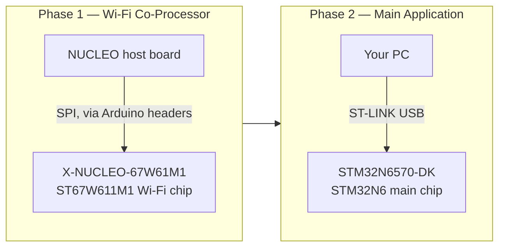
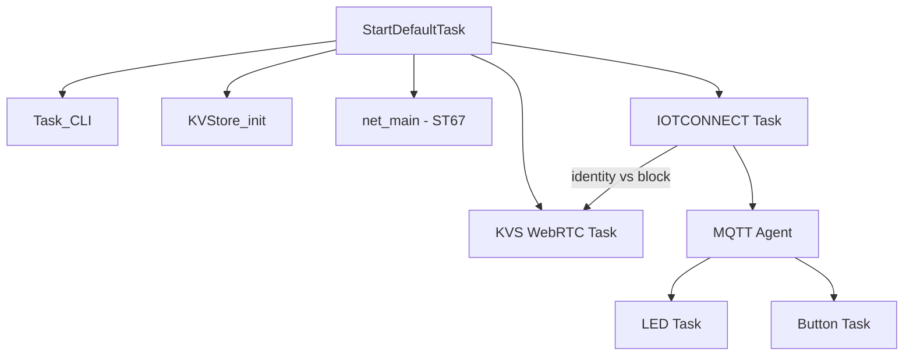

# STM32N6570-DK + ST67W611M1 + KVS WebRTC

### IOTCONNECT Reference Firmware with Live Video Streaming

[](https://www.st.com/en/evaluation-tools/stm32n6570-dk.html)
[](https://www.freertos.org/)
[](https://iotconnect.io/)
[](https://docs.aws.amazon.com/kinesisvideostreams-webrtc-dg/latest/devguide/what-is-kvswebrtc.html)
[](https://www.st.com/content/st_com/en/campaigns/st67w-wifi6-bluetooth-thread-module-z13.html)
[](./LICENSE.md)

IOTCONNECT reference firmware for the [STM32N6570-DK](https://www.st.com/en/evaluation-tools/stm32n6570-dk.html)
with [ST67W611M1](https://www.st.com/content/st_com/en/campaigns/st67w-wifi6-bluetooth-thread-module-z13.html) Wi-Fi 6
module.

> [!TIP]
> **🚀 New here? Start with the [QUICKSTART](QUICKSTART.md).** It takes you from nothing to a live
> device — IOTCONNECT account, flashing **pre-built firmware** (Wi-Fi *or* Ethernet variants,
> one-file hex images, no IDE or build tools), provisioning, and a working dashboard — using only
> STM32CubeProgrammer, on Windows or Linux. This readme covers the full project (building from
> source, architecture, module details).

Features:

- **IOTCONNECT** MQTT telemetry and cloud-to-device commands
- **AWS KVS WebRTC** live video streaming (auto-configured from IOTCONNECT identity) over **Wi-Fi or
  on-board Gigabit Ethernet** (see [docs/ethernet_support.md](docs/ethernet_support.md))
- **On-device AI people detection** on the Neural-ART NPU (YOLOv2) with telemetry and LCD overlay
- **LCD live preview** with detection boxes, cloud-controllable (`LCD_ON`/`LCD_OFF`)
- Hardware-accelerated cryptography (RNG, SHA256, AES, PKA)
- On-device certificate generation and PKCS#11 key management

---

1. [What This Project Covers](#what-this-project-covers)
2. [Hardware You Need](#hardware-you-need)
3. [Software You Need](#software-you-need)
4. [The Two-Phase Flash Workflow](#the-two-phase-flash-workflow)
5. [Clone This Repository](#clone-this-repository)
6. [Step 1: Flash the Wi-Fi Module Firmware](#step-1-flash-the-wi-fi-module-firmware)
7. [Step 2: Create bin/config.json](#step-2-create-binconfigjson)
8. [Step 3: Flash the Main Board](#step-3-flash-the-main-board)
9. [Step 4: Provision for IOTCONNECT](#step-4-provision-for-iotconnect)
10. [Step 5: Verify the Demo](#step-5-verify-the-demo)
11. [KVS WebRTC Video Streaming](#kvs-webrtc-video-streaming)
12. [Hardware Crypto Acceleration](#hardware-crypto-acceleration)
13. [Build Configurations](#build-configurations)
14. [Runtime Architecture](#runtime-architecture)
15. [Documentation](#documentation)
16. [Module Guides](#module-guides)

---

## What This Project Covers

- **Hardware**: STM32N6570-DK + ST67W611M1 (T02 mission profile, Wi-Fi 6)
- **Cloud**: IOTCONNECT (AWS backend) with automatic KVS WebRTC configuration
- **Security**: MbedTLS 3.1.1 with hardware crypto accelerators, PKCS#11
- **Video**: KVS WebRTC peer-to-peer streaming from the on-board camera
- **Demos**: LED control and button reporting over IOTCONNECT

---

## Hardware You Need

This project involves **two separate boards**, because the Wi-Fi module firmware and the main application firmware are
flashed through two different pieces of hardware:

| Board                                              | Role                                                                                                                                                                            | Purchase Link                                                          |
|----------------------------------------------------|---------------------------------------------------------------------------------------------------------------------------------------------------------------------------------|------------------------------------------------------------------------|
| **STM32N6570-DK**                                  | The main development kit. Runs the application firmware you'll be working with for the rest of this guide.                                                                      | [st.com](https://www.st.com/en/evaluation-tools/stm32n6570-dk.html)    |
| **X-NUCLEO-67W61M1**                               | Expansion board carrying the ST67W611M1 Wi-Fi 6 module. This is what you're actually updating firmware on in Step 1.                                                            | [st.com](https://www.st.com/en/evaluation-tools/x-nucleo-67w61m1.html) |
| A **NUCLEO host board** (e.g. **NUCLEO-U575ZI-Q**) | Acts as the programmer for the X-NUCLEO-67W61M1. The X-NUCLEO board has no USB of its own — it needs a NUCLEO board's Arduino-shield headers and onboard ST-LINK to be flashed. | [st.com](https://www.st.com/en/evaluation-tools/nucleo-u575zi-q.html)  |

Also needed:

- Two USB cables (one for the NUCLEO host board's ST-LINK port, one for the STM32N6570-DK's ST-LINK port)
- An [IOTCONNECT account](https://iotconnect.io/) (a free trial is available)

> [!NOTE]
> You only need the X-NUCLEO + NUCLEO pairing for **Step 1** (flashing the Wi-Fi module). Once that's done, everything
> else in this guide only touches the STM32N6570-DK.

---

## Software You Need

- [STM32CubeProgrammer](https://www.st.com/en/development-tools/stm32cubeprog.html) **`2.20.0` or newer**

  > [!IMPORTANT]
  > Starting with STM32CubeProgrammer `2.21.0`, ST's signing tool no longer auto-pads STM32N6
  > payloads to the `0x400` offset — the **`-align` flag is mandatory** there ([ST errata](https://wiki.st.com/stm32mcu/wiki/STM32CubeProgrammer_errata_2.23.x));
  > images signed without it flash successfully but **silently never boot**. `bin/flash.ps1`
  > detects your tool version and appends `-align` automatically. If you sign manually with the
  > CLI commands below, keep `-align` on `2.21.0+` and drop it on `2.20.x` (the flag doesn't exist
  > there — `2.20.x` pads automatically). Both paths validated on-board with `2.20.0` and `2.23.0`.
  > See [docs/troubleshooting.md](docs/troubleshooting.md) for details.

- [STM32CubeIDE](https://www.st.com/en/development-tools/stm32cubeide.html) — only needed if you're building firmware
  from source. Pre-built binaries are already committed under `bin/FSBL` and `bin/Appli`, so most users can skip this.
- [X-CUBE-ST67W61](https://github.com/STMicroelectronics/x-cube-st67w61) — Wi-Fi middleware and module firmware. You'll
  clone this separately in Step 1; **V1.3.0+ is required** (earlier versions have a WAN UDP receive bug that breaks
  WebRTC ICE/TURN negotiation).

**Linux-only prerequisites:**

> [!NOTE]
> STM32CubeProgrammer needs udev rules on Linux, or it fails with `libusb couldn't open USB device, errno=13` (
> permission denied) the first time you connect a board. Run this once, after installing STM32CubeProgrammer:
> ```sh
> sudo cp ~/STMicroelectronics/STM32Cube/STM32CubeProgrammer/Drivers/rules/*.rules /etc/udev/rules.d/
> sudo udevadm control --reload-rules && sudo udevadm trigger
> sudo usermod -aG plugdev $USER
> ```
> Then unplug and replug the board. If you were just added to the `plugdev` group, log out and back in (or reboot) for
> it to take effect.

- A serial terminal: `picocom` or `minicom` (`sudo apt install picocom`)

---

## The Two-Phase Flash Workflow

Before diving in, it helps to know what you're actually doing across the next few steps. There are **two independent
chips** involved, flashed through **two independent processes**, in a specific order:



1. **Wi-Fi co-processor firmware** (Step 1): The ST67W611M1 Wi-Fi chip runs its own separate firmware, called the **T02
   mission profile**. "T02" means the Wi-Fi chip runs a minimal network co-processor (NCP) stack while the main STM32N6
   handles the full LwIP network stack over SPI — as opposed to "T01," where LwIP runs embedded in the Wi-Fi chip
   itself. This repo's middleware is built around T02, so that's the profile you need. This firmware is pushed onto the
   Wi-Fi chip using a **separate NUCLEO board acting as a programmer** — the X-NUCLEO-67W61M1 has no USB connector of
   its own.

2. **Main application firmware** (Steps 2-4): The STM32N6 application (this repo's firmware) is flashed directly onto
   the STM32N6570-DK using its own onboard ST-LINK, completely independent of the Wi-Fi flashing hardware.

**Order matters**: flash the Wi-Fi module first. If the STM32N6570-DK application boots and tries to talk to Wi-Fi
firmware older than V1.3.0, WebRTC ICE/TURN negotiation will silently fail even though the device otherwise connects
fine.

---

## Clone This Repository

```sh
git clone --recurse-submodules https://github.com/avnet-iotconnect/iotc-stm32-n6-w6x-kvs-webrtc.git
cd iotc-stm32-n6-w6x-kvs-webrtc
```

---

## Step 1: Flash the Wi-Fi Module Firmware

### Connect the hardware

1. Plug the **X-NUCLEO-67W61M1** into the **Arduino-shield headers** on top of your NUCLEO host board (e.g.
   NUCLEO-U575ZI-Q).
2. Connect a USB cable from your PC to the NUCLEO host board's **ST-LINK USB port** (not the X-NUCLEO board — it has no
   USB port of its own).

### Get the flashing tool

```sh
git clone https://github.com/STMicroelectronics/x-cube-st67w61.git
```

The script you need is in this cloned repo, not in `iotc-stm32-n6-w6x-kvs-webrtc`:

```
x-cube-st67w61/Projects/ST67W6X_Scripts/Binaries/
```

> [!NOTE]
> The script is `NCP_update_mission_profile_t02.sh` on Linux/macOS and `NCP_update_mission_profile_t02.bat` on Windows —
> not a `.ps1` file.

### Linux: fix the bundled binary's permissions first

```sh
cd x-cube-st67w61/Projects/ST67W6X_Scripts/Binaries
chmod +x QConn_Flash/QConn_Flash_Cmd-ubuntu
```

> [!IMPORTANT]
> Skipping this causes the update script to fail partway through with `Permission denied` on `QConn_Flash_Cmd-ubuntu`,
> even though the script itself starts running fine. This binary ships without the executable bit set.

### Run the update

From `x-cube-st67w61/Projects/ST67W6X_Scripts/Binaries/`:

```sh
./NCP_update_mission_profile_t02.sh
```

(On Windows, double-click or run `NCP_update_mission_profile_t02.bat` from the same directory.)

This script flashes a helper application onto the NUCLEO host board's own MCU, which then pushes the T02 mission profile
firmware to the ST67W611M1 over SPI. It ends with a success message once complete — that's your signal the Wi-Fi module
is done. You will not need the NUCLEO host board or the X-NUCLEO-67W61M1 again after this step.

---

## Step 2: Create `bin/config.json`

This file holds your Wi-Fi credentials and does not exist in the repo by default — a template is committed at
`bin/config.json.example`. Create your own copy:

```sh
cp bin/config.json.example bin/config.json
```

Then edit `bin/config.json` with your actual Wi-Fi network name and password:

```json
{
  "broker_type": "iotconnect",
  "wifi_ssid": "YOUR_WIFI",
  "wifi_credential": "YOUR_PASSWORD"
}
```

---

## Step 3: Flash the Main Board

> [!NOTE]
> No build step required. Pre-built binaries are already committed at `bin/FSBL/Release/*.bin` and
> `bin/Appli/HW_Crypto/*.bin` — you only need STM32CubeProgrammer to flash them. STM32CubeIDE is only needed if you're
> modifying the firmware source yourself (see the `[!TIP]` below).

### Connect the hardware

1. With the board unplugged/unpowered, set the boot switches to **Dev mode** first (BOOT1 switch to the **right** — see
   the tip below).
2. Connect a USB cable from your PC to the **ST-LINK USB port** on the STM32N6570-DK. Since the board powers on already
   in Dev mode, no separate power-cycle is needed.

> [!TIP]
> **How to tell the board is in Dev mode:** the two labeled boot switches (SW1/SW2, near the ST-LINK connector) select
> the `BOOT0`/`BOOT1` pins. Dev Boot is selected by setting the **BOOT1** switch to the **right**; the BOOT0 switch
> position doesn't matter in this mode. As a visual check, **LED2 lights up whenever Dev Boot is active** — that's the
> most reliable way to confirm the board is actually in Dev mode, without having to trust the switch silkscreen alone.
> Flash mode (used later, after flashing) is the opposite: BOOT1 switch to the **left** and BOOT0 switch to the **left
**.

### Windows

From `bin/`:

```powershell
cd bin
.\run_all.ps1
```

`run_all.ps1` flashes the board, then prompts you to switch the board into Flash mode and continues straight into
provisioning (covered in [Step 4](#step-4-provision-for-iotconnect)). If you only want to (re)flash without
provisioning, run `.\flash.ps1` directly instead.

> [!TIP]
> If you built the firmware yourself in STM32CubeIDE rather than using the pre-built binaries, run
> `.\copy_hex_from_project.ps1` first to stage your freshly built `.bin` files into `bin/FSBL` and `bin/Appli` before
> flashing.

### Linux / macOS

There is currently no cross-platform flashing script for Linux/macOS — flash directly with the STM32CubeProgrammer CLI
tools:

```sh
CUBEPROG=~/STMicroelectronics/STM32Cube/STM32CubeProgrammer/bin/STM32_Programmer_CLI
SIGNING=~/STMicroelectronics/STM32Cube/STM32CubeProgrammer/bin/STM32_SigningTool_CLI
EXT_LOADER=~/STMicroelectronics/STM32Cube/STM32CubeProgrammer/bin/ExternalLoader/MX66UW1G45G_STM32N6570-DK.stldr
REPO=$(pwd)   # run this from the repo root

# NOTE: -align is required on STM32CubeProgrammer 2.21.0+ (drop it on 2.20.x,
# where the flag doesn't exist and payload alignment is automatic).
$SIGNING \
  -bin "$REPO/bin/FSBL/Release/stm32n6570_dk_w6x_iot_reference_FSBL.bin" \
  -nk -of 0x80000000 -t fsbl -hv 2.3 -align \
  -o /tmp/FSBL-trusted.bin

$SIGNING \
  -bin "$REPO/bin/Appli/HW_Crypto/stm32n6570_dk_w6x_iot_reference_Appli.bin" \
  -nk -of 0x80000000 -t fsbl -hv 2.3 -align \
  -o /tmp/Appli-trusted.bin

$CUBEPROG -c port=SWD mode=HOTPLUG ap=1 \
  -w /tmp/FSBL-trusted.bin 0x70000000 \
  -el "$EXT_LOADER"

$CUBEPROG -c port=SWD mode=HOTPLUG ap=1 \
  -w /tmp/Appli-trusted.bin 0x70100000 \
  -el "$EXT_LOADER"
```

Both `$CUBEPROG` commands should end with `File download complete`. That's your confirmation the flash succeeded.

macOS paths use `/Applications/STMicroelectronics/STM32CubeProgrammer.app/Contents/MacOS/bin/` instead of
`~/STMicroelectronics/STM32Cube/STM32CubeProgrammer/bin/`.

### After flashing

Unplug the USB cable, set the boot switches to **Flash mode** (BOOT1 switch left, BOOT0 switch left — see the tip
above), then reconnect the cable. LED2 should now be off, confirming the board left Dev mode.

---

## Step 4: Provision for IOTCONNECT

Provisioning creates the device's identity: it generates a key pair and self-signed certificate on-device, registers
that device in IOTCONNECT, and writes the resulting IOTCONNECT connection config (and your Wi-Fi credentials) to the
board.

> [!NOTE]
> The AWS IoT root CA (Amazon Root CA 1) and the IOTCONNECT DRA CA are baked into the firmware and auto-imported into
> PKCS#11 storage the first time the board boots with a mounted filesystem — you no longer need to run
> `pki import cert root_ca_cert` / `pki import cert iotconnect_dra_ca` manually. This only covers the AWS-hosted
> IOTCONNECT broker (`pf: aws`). If your IOTCONNECT subscription uses an Azure backend, manually re-import the
> Azure/DigiCert Global Root G2 as `root_ca_cert` (see `bin/provision.ps1`'s `$AzureMqttRootCaPem` for the PEM) — it
> will overwrite the baked-in AWS cert.

### Windows (scripted)

If you ran `run_all.ps1` in Step 3, it already dropped you into this step. Otherwise, from `bin/`:

```powershell
cd bin
.\provision.ps1
```

The script:

- auto-detects the ST-LINK virtual COM port
- reads the board's `thing_name` and lets you keep or change it
- generates a key pair and self-signed certificate on-device
- prints the certificate and pauses, waiting for you to create the device in IOTCONNECT
- once you paste back the downloaded device JSON, writes the IOTCONNECT config, imports root CAs, and resets the board

When it pauses, follow the [Create the device in IOTCONNECT](#create-the-device-in-iotconnect) steps below, then come
back and paste the JSON when prompted (end the paste with `ENDJSON` on its own line).

### Linux / macOS (manual)

The provisioning scripts are PowerShell and rely on Windows-only COM-port APIs (`Win32_SerialPort`, and a `COM\d+`-only
port-name format) — they cannot run on Linux or macOS, even under PowerShell Core. Provision manually over a serial
terminal instead; the commands below are the exact same CLI commands `provision.ps1` sends automatically.

1. Open a serial connection to the board (try `/dev/ttyACM1` if `ttyACM0` doesn't show up):
   ```sh
   picocom -b 115200 /dev/ttyACM0
   ```
2. Read the board's identity:
   ```
   conf get thing_name
   ```
   Note the value — you'll use it as both `Unique Id` and `Device Name` in IOTCONNECT.
3. Generate an on-device key pair and self-signed certificate:
   ```
   pki generate key tls_key_pub tls_key_priv ec prime256v1
   pki generate cert tls_cert tls_key_priv
   ```
   The second command prints the certificate in PEM format (`-----BEGIN CERTIFICATE-----` ...
   `-----END CERTIFICATE-----`). Copy that whole block out of your terminal scrollback — you'll paste it into IOTCONNECT
   in the next section.
4. Follow [Create the device in IOTCONNECT](#create-the-device-in-iotconnect) below, then come back here.
5. Write the IOTCONNECT connection config, using the values from the device JSON you downloaded in IOTCONNECT (`pf` →
   `aws`/`azure`, `cpid`, `env`), and your Wi-Fi credentials:
   ```
   conf set broker_type iotconnect
   conf set iotc_cloud <aws-or-azure>
   conf set iotc_cpid <your-cpid>
   conf set iotc_env <your-env>
   conf set iotc_app_mode demo
   conf set iotc_identity_json
   conf set wifi_ssid <your-wifi-ssid>
   conf set wifi_credential <your-wifi-password>
   conf set iotc_cache_valid 0
   ```
   > [!IMPORTANT]
   > `conf set iotc_identity_json` is set with **no value** (clears any previously cached identity) — do **not**
   > paste the downloaded device JSON here. The CLI's input line limit is 128 characters, far shorter than the JSON
   > blob, and the firmware doesn't consume it that way regardless: it fetches its IOTCONNECT identity dynamically at
   > runtime from `pf`/`cpid`/`env`/`uid` (already set above) plus its on-device certificate. The downloaded JSON is
   > only needed to read `pf`/`cpid`/`env` for the commands above.
7. Commit and reboot:
   ```
   conf commit
   reset
   ```

### Create the device in IOTCONNECT

1. Log into [console.iotconnect.io](https://console.iotconnect.io).
2. Go to **Device → Templates → Create Template → Import**, and import [
   `IOTCONNECT_Templates/stm32n6wrt.json`](IOTCONNECT_Templates/stm32n6wrt.json).
   > [!IMPORTANT]
   > Use `stm32n6wrt.json`, not `stm32n6_w6x_iot_template_completed.json` — the latter has no video-streaming
   > properties configured and will not support the KVS WebRTC demo.
3. Go to **Device → Create Device**.
4. Set **Unique ID** and **Device Name** to the board's `thing_name` from earlier (both identical).
5. Select the appropriate **Entity**.
6. Select the template you just imported.
7. Under Streaming/certificate settings:
    - **Stream Type**: `Module Based`
    - **Stream Resource**: `WebRTC`
    - **Auto Start Video Stream**: leave **off** (default) — the device starts streaming on demand when you click
      **Start** on the Video Streaming tab (see [Step 5](#step-5-verify-the-demo)), not automatically on connect.
    - **Device Certificate**: `Use my certificate` — do **not** select `Auto-generated`.
8. Paste the on-device certificate (from Step 3 above) into the certificate text box.
9. Click **Save and View**.
10. On the device's page, click the document-and-gear icon (near "Connection Info") to download the device configuration
    JSON. Save it — this is what you paste back into the provisioning script/CLI.

---

## Step 5: Verify the Demo

After the board resets:

1. Open a serial terminal at **115200 8N1** on the ST-LINK VCP (`picocom -b 115200 /dev/ttyACM0` on Linux, or your
   terminal of choice on Windows).
2. Wait up to 60 seconds. You should see the device connect to IOTCONNECT.
3. Confirm the device shows as connected on its page in the IOTCONNECT UI.
4. If the template has Video Streaming enabled, look for `[KVSWebRTC]` log lines — that confirms the KVS WebRTC task
   started and is attempting to connect.
5. In IOTCONNECT, open the device's **Video Streaming** tab and click **Start** to begin the stream.

If the device doesn't connect, see [docs/troubleshooting.md](docs/troubleshooting.md).

---

## KVS WebRTC Video Streaming

KVS WebRTC configuration is **automatic** when the IOTCONNECT device template has Video Streaming enabled:

1. The IOTCONNECT identity response includes a `vs` (video streaming) block with the KVS signaling channel ARN and
   credentials endpoint.
2. The firmware parses this at runtime and configures the KVS WebRTC peer automatically.
3. No manual KVS configuration is needed.

If the device template does not have Video Streaming enabled, the KVS task falls back to KVStore-based configuration.

---

## Hardware Crypto Acceleration

| Accelerator | Use Case                                  |
|-------------|-------------------------------------------|
| **RNG**     | Secure key generation, TLS nonce/IV       |
| **SHA256**  | Certificate validation, message integrity |
| **AES**     | TLS symmetric encryption                  |
| **PKA**     | TLS handshake (ECDSA), certificate auth   |

Enabled by default via MbedTLS hardware abstraction (`aes_alt`, `sha256_alt`, `rng_alt`, `ecp_alt`).

---

## Build Configurations

| Configuration           | Crypto                | Use Case            |
|-------------------------|-----------------------|---------------------|
| **HW_Crypto** (default) | Hardware accelerators | Production          |
| **SW_Crypto**           | Software-only mbedTLS | Development/testing |

---

## Runtime Architecture



---

## Documentation

| Topic                       | File                                                                                         |
|-----------------------------|----------------------------------------------------------------------------------------------|
| Architecture and middleware | [docs/architecture.md](docs/architecture.md)                                                 |
| Software components         | [docs/software_components.md](docs/software_components.md)                                   |
| Flash and RAM layout        | [docs/memory_layout.md](docs/memory_layout.md)                                               |
| Security                    | [docs/securing_the_application.md](docs/securing_the_application.md)                         |
| Build, debug, flash         | [docs/debug.md](docs/debug.md)                                                               |
| MQTT data model             | [docs/mqtt_data_model.md](docs/mqtt_data_model.md)                                           |
| Repository structure        | [docs/repo_structure.md](docs/repo_structure.md)                                             |
| Troubleshooting             | [docs/troubleshooting.md](docs/troubleshooting.md)                                           |
| Hardware crypto             | [Appli/Core/Src/crypto/CRYPTO_ACCELERATORS.md](Appli/Core/Src/crypto/CRYPTO_ACCELERATORS.md) |
| IOTCONNECT template         | [IOTCONNECT_Templates/README.md](IOTCONNECT_Templates/README.md)                             |

---

## Module Guides

- LED app: [Appli/Common/app/led/readme.md](Appli/Common/app/led/readme.md)
- Button app: [Appli/Common/app/button/readme.md](Appli/Common/app/button/readme.md)
- CLI: [Appli/Common/cli/ReadMe.md](Appli/Common/cli/ReadMe.md)
- Crypto: [Appli/Common/crypto/ReadMe.md](Appli/Common/crypto/ReadMe.md)
- KVStore: [Appli/Common/kvstore/ReadMe.md](Appli/Common/kvstore/ReadMe.md)
